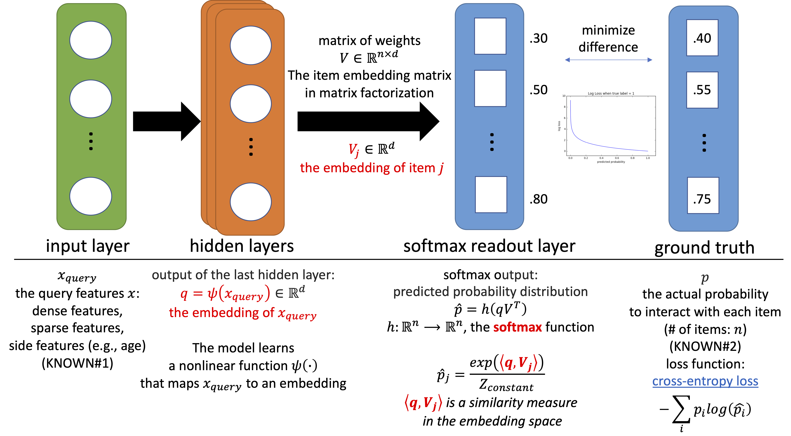

# <a href="https://en.wikipedia.org/wiki/Deep_learning">Deep Neural Network</a>: <a href="https://developers.google.com/machine-learning/recommendation/dnn/softmax">Softmax</a>
- To compute personalized preferences for a latent factor model for <b><a href="../recommendation_system">recommendations</a></b>.
- Specifically, to overcome limitations of <b>matrix factorization</b> in <a href="../collaborative_filtering">collaborative filtering</a>, including difficulty to use side features, and the cold start problem.

Disclaimer: this repository is based on my own research using various knowledge bases, including <a href="https://developers.google.com/machine-learning/recommendation">Google's machine learning course</a>.

## Example

Please see <a href="../collaborative_filtering">collaborative filtering</a>

## <a href="https://developers.google.com/machine-learning/recommendation/dnn/softmax">Concepts</a>

## <a href="https://developers.google.com/machine-learning/recommendation/dnn/training">Comparisons</a>

DNN: Softmax | Matrix factorization
--- | ---
For capturing personalized preferences | For large collection of items
Harder to train | Harder to include query features
the query (or user) embedding needs to be computed at serve time | the query (or user) embedding can be referenced as it's stored statically in the user embedding matrix

