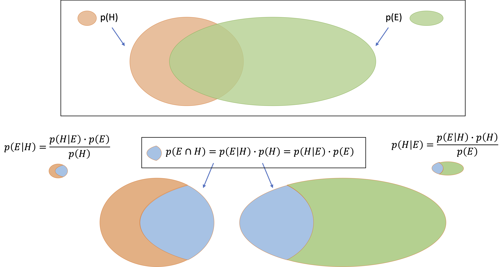

# Naive Bayes 

<hr>

## Example

<hr>

## Concepts

### 1. Naive Assumptions

- Every pair of feature variables is independent of each other (Note. this assumption is generally incorrect, but NB still often works well in practice)
- The contribution each feature makes to the target variable is equal.

<hr>

### 2. <a href="https://en.wikipedia.org/wiki/Bayes%27_theorem">Bayes' theorem</a>

<p align="center"></p>

<hr>

#### Example of Bayes' theorem

```
p(H | E) = p(E | H) * p(H) / p(E)
Note. [E = Event/Evidence] should occur before [H = Hypothesis]
```

Probability | Example | Interpretation
--- | --- | ---
P(Hypothesis\|Event) | P(class="Buying_product_Y" \| behavior="clicking_on_link_A") | - Among customers who have clicked on a specific link #A, the proportion of them who then also bought product #Y;<br/>- This is known as the <b>posterior probability</b> of H, namely, after E is observed
P(Event\|Hypothesis) | P(behavior="clicking_on_link_A" \| class="Buying_product_Y") | This is from the training data. Among customers who bought product #Y, the proportion of them who have also clicked on a specific link #A beforehand
P(Hypothesis) | P(class="Buying_product_Y") | - The proportion of customers who bought product #Y (without any knowledge of the links they have clicked beforehand);<br/>- This is known as the <b>prior probability</b> of H (namely, before E is observed)
P(Event) | P(behavior="clicking_on_link_A") | The proportion of customers who clicked link #A (without any knowledge of the product they then bought)

<hr>

## Family of Naive Bayes Algorithms

Algorithm | Assumption regarding the distribution of P(x<sub>i</sub> | y) | Application
--- | --- | ---
Gaussian Naive Bayes | --- |
Multinomial Naive Bayes | --- | Document classification
Bernoulli Naive Bayes | --- | 
