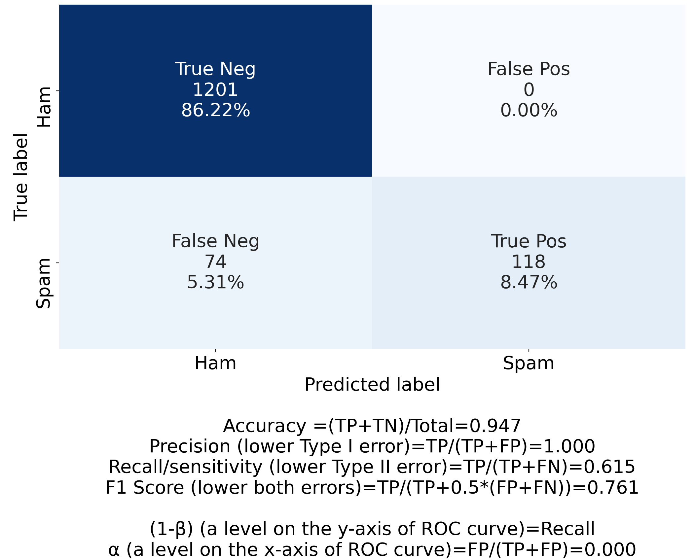
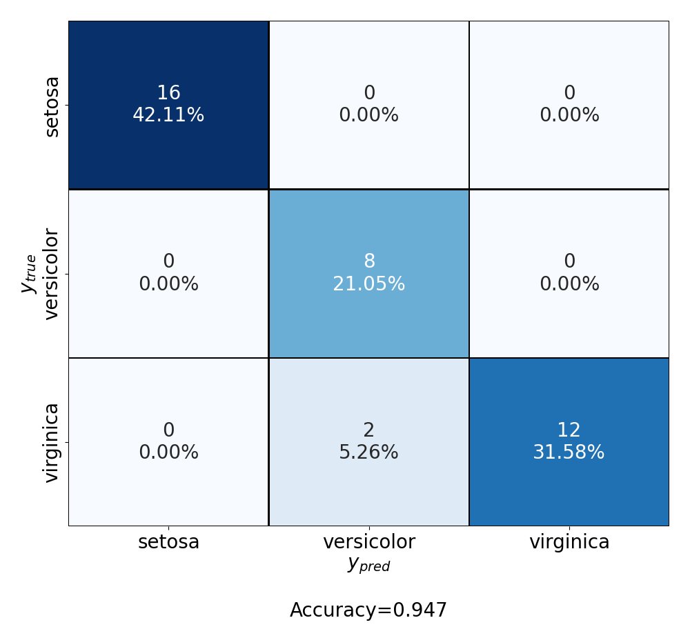

# Naive Bayes 

<hr>

## Concepts

### 1. Naive Assumptions

- Every pair of feature variables is <b>independent</b> of each other (Note. this assumption is generally incorrect, but NB still often works well in practice)
- The contribution each feature makes to the target variable is <b>equal</b>.

<hr>

### 2. <a href="https://en.wikipedia.org/wiki/Bayes%27_theorem">Bayes' theorem</a>

<p align="center"></p>

<hr>

#### Example of Bayes' theorem

```
p(H | E) = p(E | H) * p(H) / p(E)
Note. [E = Event/Evidence] should occur before [H = Hypothesis]
```

Probability | Example | Interpretation
--- | --- | ---
P(Hypothesis\|Event) | P(class="Buying_product_Y" \| behavior="clicking_on_link_A") | - Among customers who have clicked on a specific link #A, the proportion of them who then also bought product #Y;<br/>- This is known as the <b>posterior probability</b> of H, namely, after E is observed
P(Event\|Hypothesis) | P(behavior="clicking_on_link_A" \| class="Buying_product_Y") | This is from the training data. Among customers who bought product #Y, the proportion of them who have also clicked on a specific link #A beforehand
P(Hypothesis) | P(class="Buying_product_Y") | - The proportion of customers who bought product #Y (without any knowledge of the links they have clicked beforehand);<br/>- This is known as the <b>prior probability</b> of H (namely, before E is observed)
P(Event) | P(behavior="clicking_on_link_A") | The proportion of customers who clicked link #A (without any knowledge of the product they then bought)

<hr>

### 3. Naive Bayes

- y = target/outcome
- X = features (x<sub>1</sub>, x<sub>2</sub>, ..., x<sub>n</sub>)

The goal is to estimate p(y|X) = p(X|y) * p(y) / p(X)

Because every feature is assumed to be independent of each other, p(X) = p(x<sub>1</sub> ⋂ x<sub>2</sub> ⋂ ... ⋂ x<sub>n</sub>) = p(x<sub>1</sub>) * p(x<sub>2</sub>) * ... * p(x<sub>n</sub>) = a constant,<br/>
p(y|X) &Proportional; p(X|y) * p(y) = p(y) * p(x<sub>1</sub>|y) * p(x<sub>2</sub>|y) * ... * p(x<sub>n</sub>|y) = p(y) * <b>product(i=1 to n)p(x<sub>i</sub>|y)</b>

Then, based on the maximum value of p(y|X) across all values of y, we will classify the outcome to that specific y<sub>j</sub>.<br/>
Note: the summation of all conditional probabilities, <b>p(y<sub>j</sub>|X) = 1</b>, j = 1 ... m (e.g., if outcome is spam or no spam, m = 2)

<hr>

## Family of Naive Bayes Algorithms

Algorithm | Assumption regarding the distribution of P(x<sub>i</sub>\|y) | Application
--- | --- | ---
<a href="https://github.com/daniel-yj-yang/distribution">Gaussian</a> Naive Bayes | P(x<sub>i</sub>\|y) is normally distributed | - X are continuous variables.
<a href="https://github.com/daniel-yj-yang/distribution">Multinomial</a> Naive Bayes | P(x<sub>i</sub>\|y) is generated by a <a href="https://github.com/daniel-yj-yang/distribution">multinomial distribution</a> | - Used for document classification / spam filtering;<br/>- X are independent discrete variables with 3+ levels (e.g., term frequency in the document).
<a href="https://github.com/daniel-yj-yang/distribution">Bernoulli</a> Naive Bayes | P(x<sub>i</sub>\|y) is generated by a multivariate <a href="https://github.com/daniel-yj-yang/distribution">Bernoulli distribution</a> | - Used for document classification / spam filtering;<br/>- X are independent binary variables (e.g., whether a word occurs in a document or not).

<hr>

## Pros and Cons
Comparison | Details
--- | ---
Pros | - Requiring only a small amount of training data to estimate the needed parameters;<br/>- Extremely fast, as each p(x<sub>i</sub>\|y) can be independently estimated using a 1D distribution.
Cons | - Missing certain combination of values in your training data will lead to poor performance (e.g., y="spam", x=containing('$$$'), but there is no such occurrence in the training set);<br/>- Naive Bayes does not work when the relationship between words is important and must be accounted for (e.g., sentiment analysis).

<hr>

## Examples

Please see Python codes <a href="NB_classifiers.py">here</a>.

### 1. Build a spam filter using Multinomial Naive Bayes classifier

<p align="center"></p>

<table align="center">
  <tr>
    <td>
      <p align="center"></p>
    </td>
    <td>
      <p align="center"></p>
    </td>
  </tr>
</table>

Notes:
- AUC = an aggregate measure of performance across all possible classification thresholds. Interpretation: the probability that the model ranks a random positive example (True Positive) more highly than a random negative example (False Positive) (> 50% of the time).
- Accuracy = (TP+TN)/Total (To maximize correct decisions)
- Precision = TP/(TP+FP) (To minimize Type I error)
- Recall = TP/(TP+FN) (To minimize Type II error)
- F1 score = the harmonic mean of precision and recall = 2/((1/precision)+(1/recall)) = a measure of accuracy (To minimize both Type I and II errors)

<hr>

### 2. Using Gaussian Naive Bayes to classify iris

<p align="center"></p>
