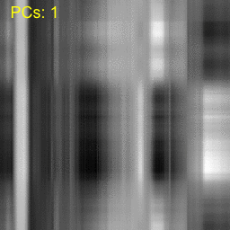
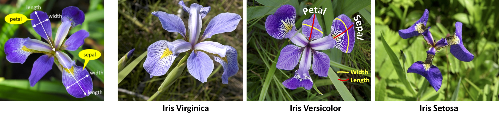
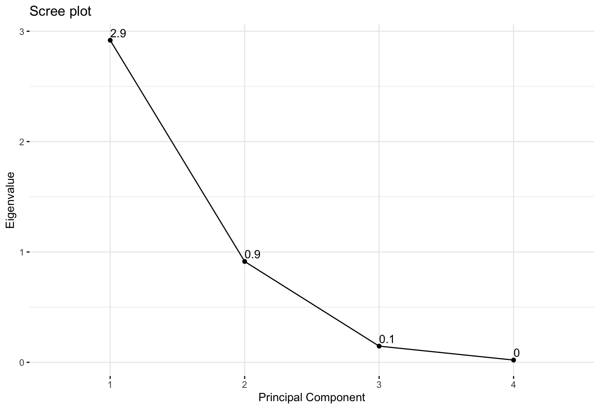
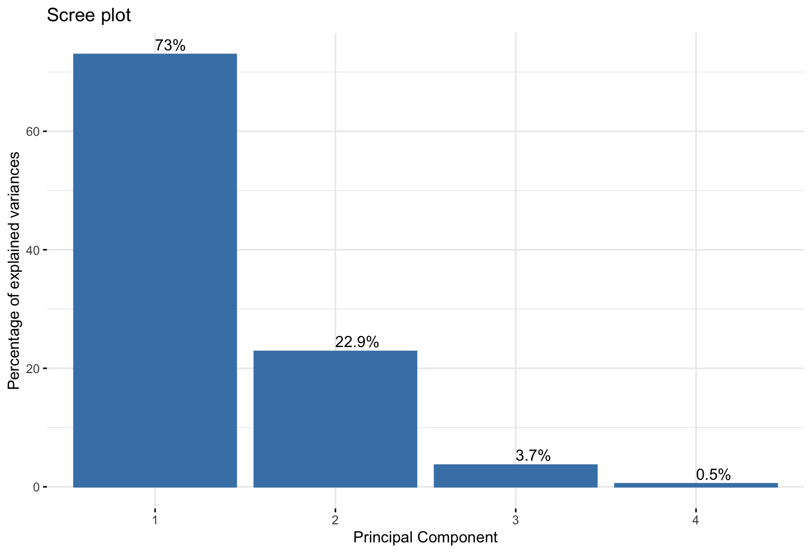
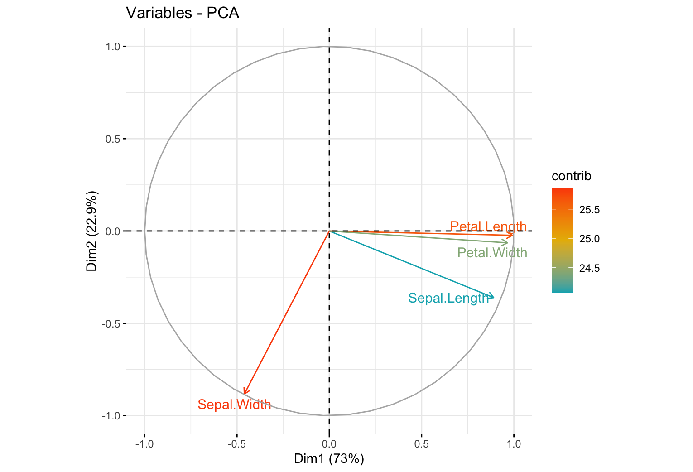
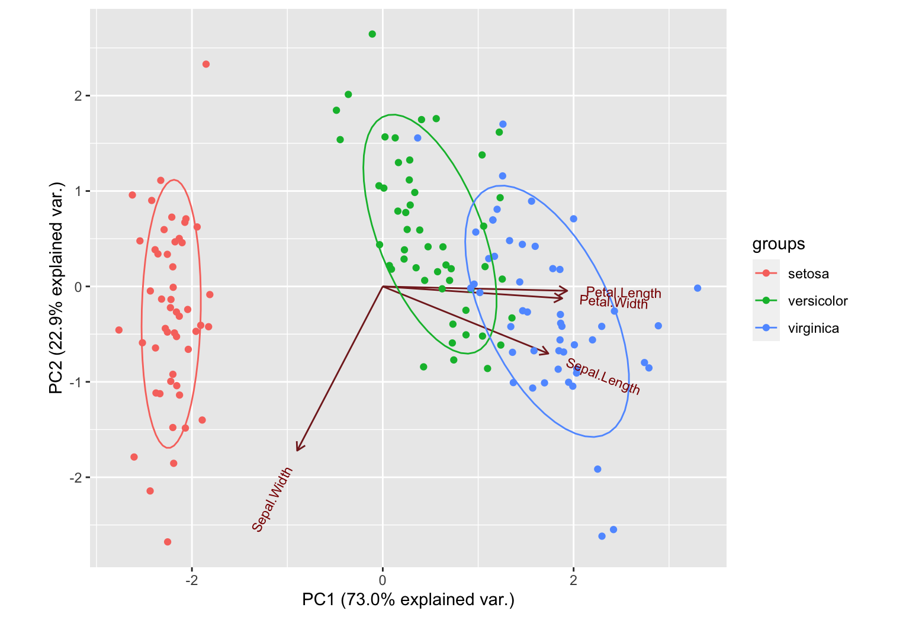

# Principal Component Analysis
To project complicated original data onto a lower dimensional (e.g., 2D) space

<hr>

### Key Concepts of PCA

#### Common-Language Goal
To find ```m``` principal components to account for most of the variation in ```X```, where ```m``` << ```p```

- <a href="./README.md#approach-1-eigendecomposition-of-the-data-covariance-matrix">Approach 1: Eigendecomposition of the data covariance matrix</a>
- <a href="./README.md#approach-2-singular-value-decomposition-of-the-data-matrix">Approach 2: Singular value decomposition of the data matrix</a>

<hr>

### Approach 1: Eigendecomposition of the data covariance matrix

#### Background Concepts

A covariance matrix ```Q``` reflects the variation/variability of ```p``` features in ```X```.

- ```Q = X'X / (n-1)```

Matrix | Meaning
--- | ---
<b>X</b> | the empirical n x p matrix for the original ```p``` variables, column centered
<b>Q</b> | the empirical p x p covariance matrix for the original variables

<hr>

#### Technical Goal
To find the eigenvalues and eigenvectors of the covariance matrix ```Q``` that <a href="http://www.stat.columbia.edu/~fwood/Teaching/w4315/Fall2009/pca.pdf">decompose</a> and reproduce ```Q``` (note: ```Q = WΛW'```), which can be used to derive a truncated projected score matrix <b>T<sub>L</sub></b> for the first ```L``` largest eigenvalues and their eigenvectors.

Matrix | Meaning
--- | ---
<b>W</b> | A p x p matrix of weights whose columns are the <a href="https://en.wikipedia.org/wiki/Eigenvalues_and_eigenvectors">eigenvectors</a> ```v``` of ```Q```
<b>Λ</b> | A <a href="https://en.wikipedia.org/wiki/Diagonal_matrix">diagonal matrix</a> whose diagnoal elements are the <a href="https://en.wikipedia.org/wiki/Eigenvalues_and_eigenvectors">eigenvalues</a> ```λ``` of ```Q```
<b>T</b> | The full projected score matrix, <b>T = XW</b>, reflecting ```X``` being projected on principal component dimensions<br/><br/>Importantly, this also gives us a way to <a href="https://stats.stackexchange.com/questions/229092/how-to-reverse-pca-and-reconstruct-original-variables-from-several-principal-com">reconstruct</a> <b>X<sub>centered</sub></b>: <b>X<sub>centered_as_reconstructed_by_PCA</sub> = TW'</b><br/>and thus <b>X<sub>raw</sub> = X<sub>centered_as_reconstructed_by_PCA</sub> + X<sub>mean</sub></b>
<b>T<sub>L</sub></b> | A truncated/reduced score matrix <b>T<sub>L</sub> = XW<sub>L</sub></b>, for the first ```L``` largest eigenvalues and their eigenvectors<br/><br/>Similarly, <b>X<sub>L-reconstructed-by-PCA</sub> = T<sub>L</sub>W<sub>L</sub>'</b>

```
Q: Why using the covariance matrix (or correlation matrix if standardized), as opposed to other matrices?
```

#### Procedural Details
To find each eigenvalue ```λ``` and the corresponding eigenvector ```v``` that satisfies ```Qv = λv```.
- Importantly, we are interested in the largest few eigenvalues (e.g., ```λ1```), because their corresponding eigenvectors (e.g., ```v1```) will be dimensions that can retain the most variation present in ```X```.
- Specifically, the first principal component ```v1``` is the dimension that has maximum variance in projected data along that dimension among all principal components, namely, PC<sub>1</sub> = ```v1'X``` has the maximum variance among all PC's (note. **Var(PC<sub>1</sub>)** is actually ```λ1```), and iteratively, PC<sub>2</sub> = ```v2'X``` has the 2nd maximum variance while ```v2``` accounts for the remaining variation.

#### <a href="http://www.stat.columbia.edu/~fwood/Teaching/w4315/Fall2009/pca.pdf">Solutions</a>
- For k = 1, 2, ..., p, the k<sup>th</sup> PC is given by **z<sub>k</sub> = v<sub>k</sub>'X**, where v<sub>k</sub> is an eigenvector of ```Q``` corresponding to its k<sup>th</sup> largest eigvenvalue λ<sub>k</sub>.
- If v<sub>k</sub> is chosen to have unit length (i.e., v<sub>k</sub>'v<sub>k</sub> = 1) then **Var(z<sub>k</sub>) = λ<sub>k</sub>**.

Notes:
- Detailed explanation of <a href="./eigenvalue_and_eigenvector.md">eigenvalue and eigenvector</a>
- Importantly, ```WW' = W'W = I``` as ```W``` is orthonormal
- Property: ```Λ = W'QW```
- The sum of eigenvalues equals to the sum of the variances in ```Q```
- Why the y-axis in the scree plot is labled as percentage of explained **variance**? See an interpretation <a href="https://stats.stackexchange.com/questions/22569/pca-and-proportion-of-variance-explained">here</a>

See also:
- <a href="https://en.wikipedia.org/wiki/Principal_component_analysis">Dimensionality reduction and principal component regression</a>

<hr>

### Approach 2: <a href="https://en.wikipedia.org/wiki/Singular_value_decomposition">Singular value decomposition</a> of the data matrix
As another matrix factorization, SVD is the standard way to perform PCA because it does not require calculating the covariance matrix.

According to compact SVD, <b>X = UDV'</b>.

Matrix | Meaning
--- | ---
<b>U</b> | A n x p real-valued matrix (where <b>U'U = I<sub>p</sub></b>) with orthonormal columns
<b>D</b> | A p x p real-valued diagnoal matrix, with the non-zero singular values on the diagnoal. Importantly, <b>D<sup>2</sup> / (n-1) = Λ</b>
<b>V</b> | A p x p real-valued orthonormal matrix, where <b>V' = V<sup>-1</sup></b> and <b>V'V = VV' = I</b>. Importantly, <b>V</b> is equivalent to <b>W</b> 

Now, using <b>U</b>, <b>D</b>, and <b>V</b>, we can derive the full score matrix <b>T = UD = XV</b> and the first L columns are <b>T<sub>L</sub></b>, or equivalently <b>T<sub>L</sub> = U<sub>L</sub>D<sub>L</sub></b>.

<hr>

### Example 1 - Image reconstruction

<table align="center">
  <tr>
    <td><p align="center">
      The Lena test image, a 512x512 matrix<br/>
<br/>(test image <a href="https://www.ece.rice.edu/~wakin/images/">source</a>)</p>
    </td>
    <td><p align="center">Reconstructed using 01 - 50 out of 512 PCs<br/>
<br/>
      (generated by my own <a href="./PCA_face_reconstruction.R">code</a> in R)</p>
    </td>
  </tr>
  </table>

<hr>

### Example 2 - Eigenface

Example: Given 1000 original faces, derive 1000 principal components (eigenfaces). Take the top 50 principal components. The original face can be expressed as the following:

Original face = mean face + weighted combinations of the top 50 eigenfaces

See also:
- https://towardsdatascience.com/eigenfaces-recovering-humans-from-ghosts-17606c328184
- https://demonstrations.wolfram.com/FaceRecognitionUsingTheEigenfaceAlgorithm/
- https://www.youtube.com/watch?v=JqEI0-RCC8w

<hr>

### Example 3 - the iris dataset

<p align="center"><br/>
(image sources: <a href="https://www.fs.fed.us/wildflowers/beauty/iris/Blue_Flag/iris_virginica.shtml">virginica</a>; <a href="https://www.lakeforest.edu/academics/programs/environmental/courses/es204/iris_versicolor.php">versicolor</a>; <a href="https://alchetron.com/Iris-setosa">setosa</a>)</p>

<hr>

#### Scree plot (1): To see the eigenvalue of each principal component


<hr>

#### Scree plot (2): Or, in order words, to see how much variation each principal component captures in the data


<hr>

#### Loading plot: To see how much each feature influences a principal component


<hr>

#### Biplot: PCA score plot + loading plot


<hr>

#### Codes
- <a href="https://github.com/daniel-yj-yang/programming_language/tree/master/Clojure/build/incanter">Clojure code</a>
- <a href="./PCA.R">R code</a>

<hr>

### Reference

- <a href="https://stats.stackexchange.com/questions/2691/making-sense-of-principal-component-analysis-eigenvectors-eigenvalues/140579">Making sense of PCA</a>
