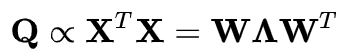

# Principal Component Analysis
To project the original data on a reduced dimensional (e.g., 2D) space

<hr>

### Math Concepts

To <a href="https://mathworld.wolfram.com/MatrixDiagonalization.html">diagonalize</a> the covariance matrix



Matrix | Meaning
--- | ---
<b>X</b> | the empirical covariance matrix for the original variables
<b>Q</b> | the empirical matrix for the original variables
<b>W</b> | the p-by-p matrix of weights whose columns are the <a href="https://en.wikipedia.org/wiki/Eigenvalues_and_eigenvectors">eigenvectors</a> of <b>X<sup>T</sup>X</b>
<b>Λ</b> | the <a href="https://en.wikipedia.org/wiki/Diagonal_matrix">diagonal matrix</a> of <a href="https://en.wikipedia.org/wiki/Eigenvalues_and_eigenvectors">eigenvalues</a> λ<sub>(k)</sub> of <b>X<sup>T</sup>X</b>

Note. 
- An eigenvalue is a number that indicates how much variance there is in the data in that direction of the eigenvector.
- See also: https://www.mathsisfun.com/algebra/eigenvalue.html

Clojure:
```Clojure
user=> (def X (matrix [[-6 3] [4 5]]))
#'user/X

user=> (decomp-eigenvalue X)
{:values (-7.0 6.0), :vectors [-0.9487 -0.2433
 0.3162 -0.9730]
}

;; Xv = λv
user=> (mmult X (sel (:vectors (decomp-eigenvalue X)) :cols 1)) ;; Xv
[-1.4595
-5.8381]

user=> (mult 6 (sel (:vectors (decomp-eigenvalue X)) :cols 1)) ;; λv, λ = 6
[-1.4595
-5.8381]
```

R:
```R
> X <- matrix(c(-6, 3, 4, 5), 2, 2, byrow = T)
> X
     [,1] [,2]
[1,]   -6    3
[2,]    4    5
> eigen(X)
eigen() decomposition
$values
[1] -7  6

$vectors
           [,1]       [,2]
[1,] -0.9486833 -0.2425356
[2,]  0.3162278 -0.9701425
```

<hr>

### Example - the iris dataset

<hr>

#### Scree plot (1): To see the eigenvalue of each principal component


<hr>

#### Scree plot (2): Or, in order words, to see how much variation each principal component captures in the data


<hr>

#### Loading plot: To see how much each feature influences a principal component


<hr>

#### Biplot: PCA score plot + loading plot


<hr>

#### Code
- <a href="./PCA.R">R code</a>

<hr>

### Reference

- <a href="https://stats.stackexchange.com/questions/2691/making-sense-of-principal-component-analysis-eigenvectors-eigenvalues/140579">Making sense of PCA</a>
