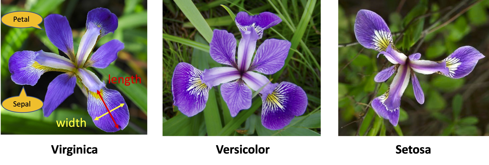

# Principal Component Analysis
To project complicated original data onto a lower dimensional (e.g., 2D) space

<hr>

### Key Concepts of PCA

#### Common-Language Goal
To find ```m``` principal components to account for most of the variation in ```X```, where ```m``` << ```p```

- Approach 1: Eigendecomposition of the data covariance matrix
- Approach 2: Singular value decomposition of the data matrix

<hr>

### Approach 1: Eigendecomposition of the data covariance matrix

#### Background Concepts

A covariance matrix ```Q``` reflects the variation/variability of ```p``` features in ```X```.

- ```Q = X'X / (n-1)```

Matrix | Meaning
--- | ---
<b>X</b> | the empirical matrix for the original ```p``` variables, column centered
<b>Q</b> | the empirical covariance matrix for the original variables

<hr>

#### Technical Goal
To find the eigenvalues and eigenvectors of the covariance matrix ```Q``` to <a href="http://www.stat.columbia.edu/~fwood/Teaching/w4315/Fall2009/pca.pdf">decompose</a> and reproduce ```Q``` (note: ```Q = WΛW'```)

Matrix | Meaning
--- | ---
<b>W</b> | the p-by-p matrix of weights whose columns are the <a href="https://en.wikipedia.org/wiki/Eigenvalues_and_eigenvectors">eigenvectors</a> ```v``` of ```Q```
<b>Λ</b> | the <a href="https://en.wikipedia.org/wiki/Diagonal_matrix">diagonal matrix</a> whose diagnoal elements are the <a href="https://en.wikipedia.org/wiki/Eigenvalues_and_eigenvectors">eigenvalues</a> ```λ``` of ```Q```

```
Q: Why using the covariance matrix (or correlation matrix if standardized), as opposed to other matrices?
```

#### Implementation Details
To find each eigenvalue ```λ``` and the corresponding eigenvector ```v``` that satisfies ```Qv = λv```.
- Importantly, we are interested in the largest few eigenvalues (e.g., ```λ1```), because their corresponding eigenvectors (e.g., ```v1```) will be dimensions that can retain the most variation present in ```X```.
- Specifically, the first principal component ```v1``` is the dimension that has maximum variance of projected data along a dimension, namely, PC<sub>1</sub> = ```v1'X``` has the maximum variance among all PC's (note. **Var(PC<sub>1</sub>)** is actually ```λ1```) (and iteratively, PC<sub>2</sub> = ```v2'X``` has the 2nd maximum variance while ```v2``` accounts for the remaining variation)

#### <a href="http://www.stat.columbia.edu/~fwood/Teaching/w4315/Fall2009/pca.pdf">Solutions</a>
- For k = 1, 2, ..., p, the k<sup>th</sup> PC is given by **z<sub>k</sub> = v<sub>k</sub>'X**, where v<sub>k</sub> is an eigenvector of ```Q``` corresponding to its k<sup>th</sup> largest eigvenvalue λ<sub>k</sub>.
- If v<sub>k</sub> is chosen to have unit length (i.e., v<sub>k</sub>'v<sub>k</sub> = 1) then **Var(z<sub>k</sub>) = λ<sub>k</sub>**.

Notes:
- Detailed explanation of <a href="./eigenvalue_and_eigenvector.md">eigenvalue and eigenvector</a>
- Importantly, ```WW' = W'W = I``` as ```W``` is orthonormal
- Property: ```Λ = W'QW```
- The sum of eigenvalues equals to the sum of the variances in ```Q```
- Why the y-axis in the scree plot is labled as percentage of explained **variance**? See an interpretation <a href="https://stats.stackexchange.com/questions/22569/pca-and-proportion-of-variance-explained">here</a>

See also:
- <a href="https://en.wikipedia.org/wiki/Principal_component_analysis">Dimensionality reduction and principal component regression</a>

<hr>

### Approach 2: <a href="https://en.wikipedia.org/wiki/Singular_value_decomposition">Singular value decomposition</a> of the data matrix

<hr>

### Example - the iris dataset

<p align="center"></p>
(image sources: <a href="https://www.fs.fed.us/wildflowers/beauty/iris/Blue_Flag/iris_virginica.shtml">virginica</a>; <a href="https://www.lakeforest.edu/academics/programs/environmental/courses/es204/iris_versicolor.php">versicolor</a>; <a href="https://alchetron.com/Iris-setosa">setosa</a>)

<hr>

#### Scree plot (1): To see the eigenvalue of each principal component


<hr>

#### Scree plot (2): Or, in order words, to see how much variation each principal component captures in the data


<hr>

#### Loading plot: To see how much each feature influences a principal component


<hr>

#### Biplot: PCA score plot + loading plot


<hr>

#### Codes
- <a href="https://github.com/daniel-yj-yang/programming_language/tree/master/Clojure/build/incanter">Clojure code</a>
- <a href="./PCA.R">R code</a>

<hr>

### Reference

- <a href="https://stats.stackexchange.com/questions/2691/making-sense-of-principal-component-analysis-eigenvectors-eigenvalues/140579">Making sense of PCA</a>
