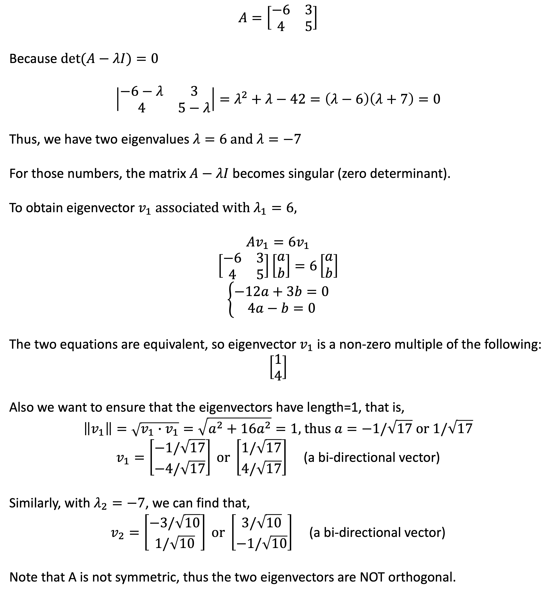

## Key Concepts

```Av = λv```

- ```A``` is a square matrix, ```v``` is an eigenvector, and ```λ``` is an eigenvalue.
- ```Av``` is pronounced as: multiplying ```v``` by ```A```.
- Almost all vectors change direction when they are multiplied by ```A```. However, certain exceptional vectors ```v``` that does not change direction when multiplied by ```A``` (a linear transformation), and the vector ```Av``` is a number (```λ```) times the original ```v```.

<hr>

## To find eigenvalues and eigenvectors of a matrix <a href="http://math.mit.edu/~gs/linearalgebra/ila0601.pdf">by hand</a>

To derive ```v``` and ```λ```, given ```A```:

```
Av - λv = 0
(A - λ·I)v = 0
If v is non-zero, the equation will only have a solution if |A - λ·I| = 0
By solving |A - λ·I| = 0, we can obtain λ
Finally, using λ, we can obtain the corresponding v
```

<p align="center"></p>

<hr>

## Examples

Clojure:
```Clojure
user=> (def A (matrix [[-6 3] [4 5]]))
#'user/A

user=> (decomp-eigenvalue A)
{:values (-7.0 6.0), :vectors [-0.9487 -0.2433
 0.3162 -0.9730]
}

;; Av = λv
user=> (mmult X (sel (:vectors (decomp-eigenvalue X)) :cols 1)) ;; Av
[-1.4595
-5.8381]

user=> (mult 6 (sel (:vectors (decomp-eigenvalue X)) :cols 1)) ;; λv, λ = 6
[-1.4595
-5.8381]
```

<hr>

Python:
```Python
>>> import numpy as np
>>> from scipy.linalg import eig
>>> A = np.array([[-6,3],[4,5]])
>>> results = eig(A)
>>> results
(array([-7.+0.j,  6.+0.j]), array([[-0.9486833 , -0.24253563],
       [ 0.31622777, -0.9701425 ]]))
```

<hr>

R:
```R
> A <- matrix(c(-6, 3, 4, 5), 2, 2, byrow = T)

> A
     [,1] [,2]
[1,]   -6    3
[2,]    4    5

> eigen(A)
eigen() decomposition
$values
[1] -7  6

$vectors
           [,1]       [,2]
[1,] -0.9486833 -0.2425356
[2,]  0.3162278 -0.9701425
```

<hr>

Thoughts:
1. Can one use dissimilarity matrix instead of covariance to feed to eigen-decomp?
