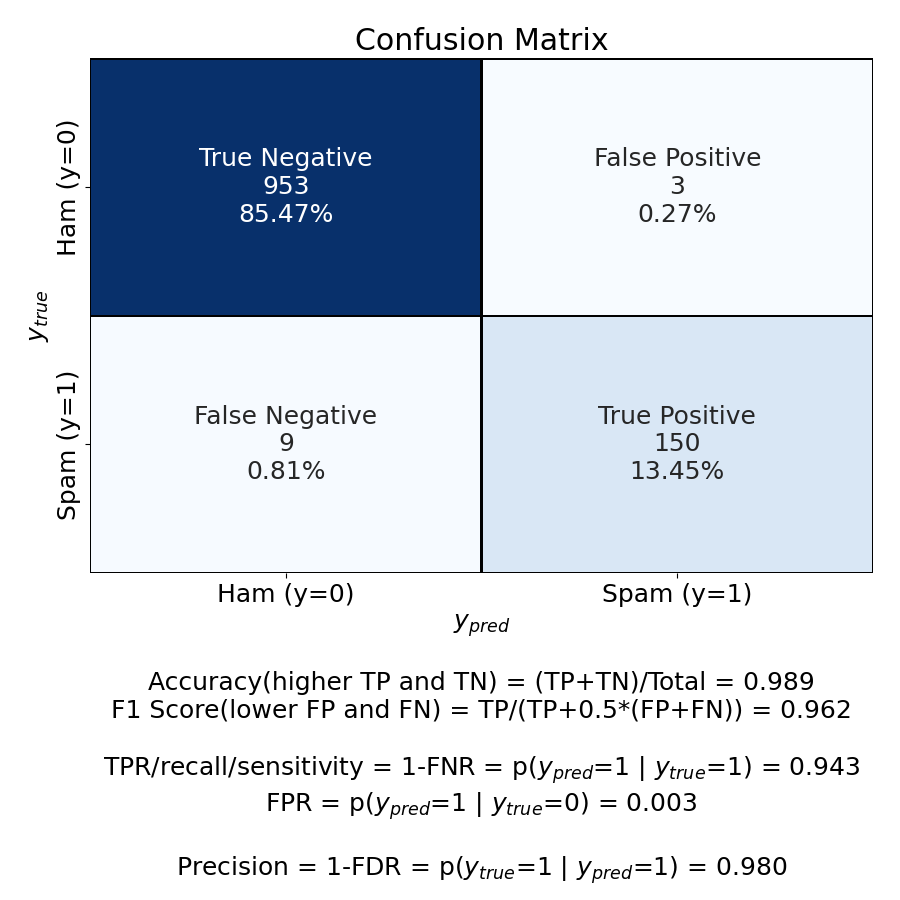
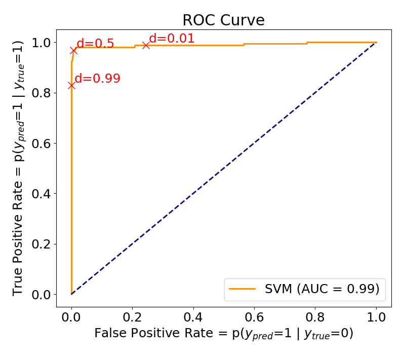

# Support Vector Machine
To separate data using a hyperplane in a higher dimension (a kernel trick) to facilitate classification

## Example 1 - SMS spam detector

* Spam detector/filter using the <a href="https://archive.ics.uci.edu/ml/datasets/SMS+Spam+Collection">UCI SMS spam dataset</a> (4,827 non-spam's and 747 spam's) (see <a href="./SMS_spam_classifier.py">my variation</a> of Python code), using 20% of the data as the test set

Hyperparameter | Confusion Matrix | ROC curve
--- | --- | ---
C = 1000 gamma = 0.001 kernel = rbf |  | 

## Example 2 - E-mail spam detector

<a href="https://www.r-bloggers.com/support-vector-machines-with-the-mlr-package/">Spam filter</a> using 4,601 E-mails (2,788 non-spam's and 1,813 spam's) and 57 variables indicating the frequency of certain words and characters (see <a href="./spam_filter_SVM.R">my variation</a> of R code)

## Concepts

* With labeled data, SVM generates multiple separating <i><b>hyperplanes</b></i> corresponding to distinct data segments such that each segment contains only one data label. It is particualrly useful when the data distribution is unknown (that is, data non-regularity).

* To do so, SVM calculates a <b>maximum-margin</b> boundary that leads to a homogeneous partition of all data points.

## Kernel function

Kernel function must be specified.

<a href="https://www.rdocumentation.org/packages/e1071/versions/1.7-3/topics/svm">Kernel function</a> | K(x_I, x_J)
--- | ---
Linear | The <a href="https://mathworld.wolfram.com/InnerProduct.html">inner product</a> of x_I and x_J, < x_I, x_J >, equivalent to no kernel
<a href="https://en.wikipedia.org/wiki/Polynomial_kernel">Polynomial</a> | (γ < x_I, x_J > + C )d, d (degree) = 2nd or 3rd
<a href="https://en.wikipedia.org/wiki/Radial_basis_function_kernel">Radial Basis Function (RBF)</a> / <a href="https://www.seas.upenn.edu/~cis519/spring2019/lectures/07_SVMs.pdf">Gaussian Kernel</a> | <b>exp</b>( -γ * \|x_I - x_J\|2 )
<a href="https://www.seas.upenn.edu/~cis519/spring2019/lectures/07_SVMs.pdf">Sigmoid (Hyperbolic Tangent)</a> | <b>tanh</b>(γ (x_I)'(x_J) + C)

## Hyperparameters

Hyperparameter | Use
--- | ---
degree | for polynomial kernel only
cost, C | how stringent (narrow) or lenient (wide) the margin is
gamma, γ | how much individual cases can influence the position of the decision boundary
