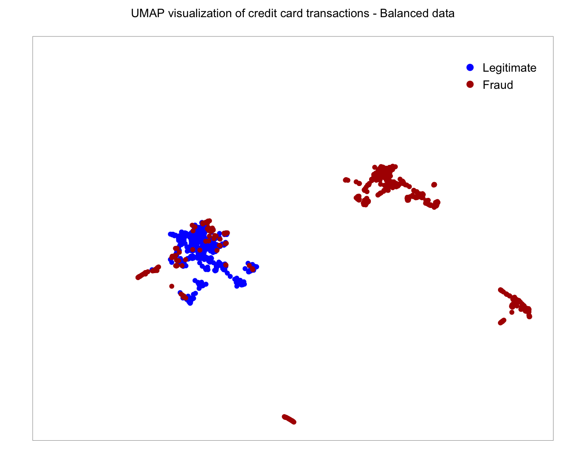
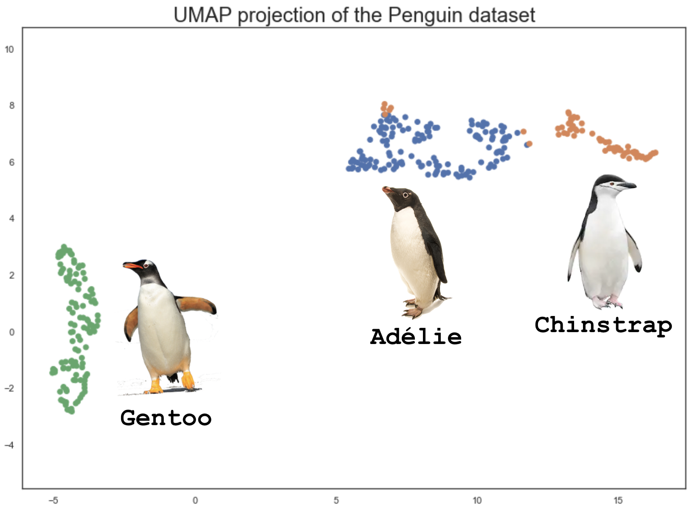
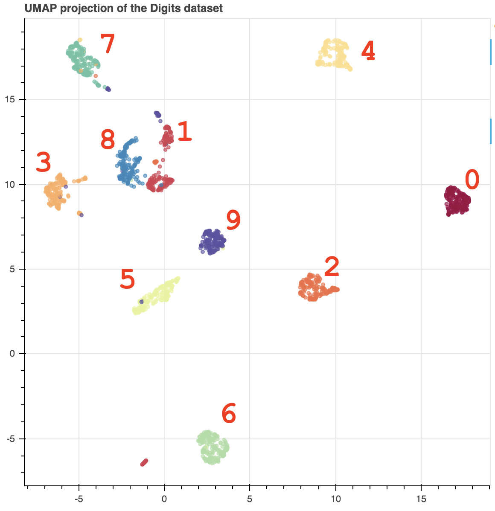

# <a href="https://github.com/lmcinnes/umap">UMAP</a> (Uniform Manifold Approximation and Projection)
To project higher-dimensional info onto a lower-dimensional space (2D or 3D) for visualization, while preserving the global structure.

Note: Compared to <a href="../t-SNE">t-SNE</a>, UMAP "arguably preserves more of the global structure with superior run time performance".

## Examples

### 1. <a href="https://www.kaggle.com/mlg-ulb/creditcardfraud">Credit fraud data</a> (my <a href="./credit_card_fraud_UMAP.R">version</a> of R code)

The dataset has 284,807 transactions (492 fraud transactions and 284,315 legitimate transactions) and 29 feature variables. Using a balanced dataset (492 fraud transactions and 492 legitimate transactions), the UMAP algorithm projects the complicated higher-dimensional relationships between the 29 feature variables to a 2D space, while preserving the global structure:

 Note. UMAP preserves much of the distinction between the two classes using the 29 feature variables without knowing the Class variable.

### 2. <a href="https://umap-learn.readthedocs.io/en/latest/basic_usage.html">Penguin data</a> (<a href="./UMAP.ipynb">Python code</a>)

Higher dimensions include the following:
- culmen (bill) length (mm)
- culmen (bill) depth (mm)
- flipper length (mm)
- body mass (g)

### 3. <a href="https://umap-learn.readthedocs.io/en/latest/basic_usage.html">Digits data</a> (<a href="./UMAP.ipynb">Python code</a>)

Higher dimensions include 8x8 images of integer pixels in the range 0...16.

## References
- <a href="https://towardsdatascience.com/how-exactly-umap-works-13e3040e1668">Why UMAP is better than t-SNE?</a>
