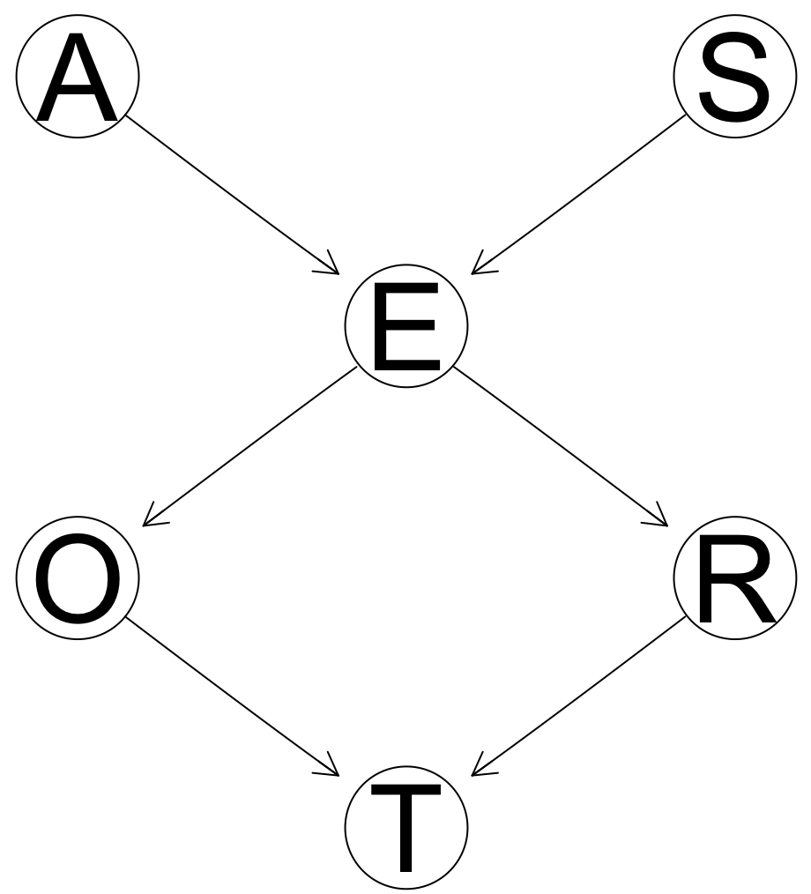
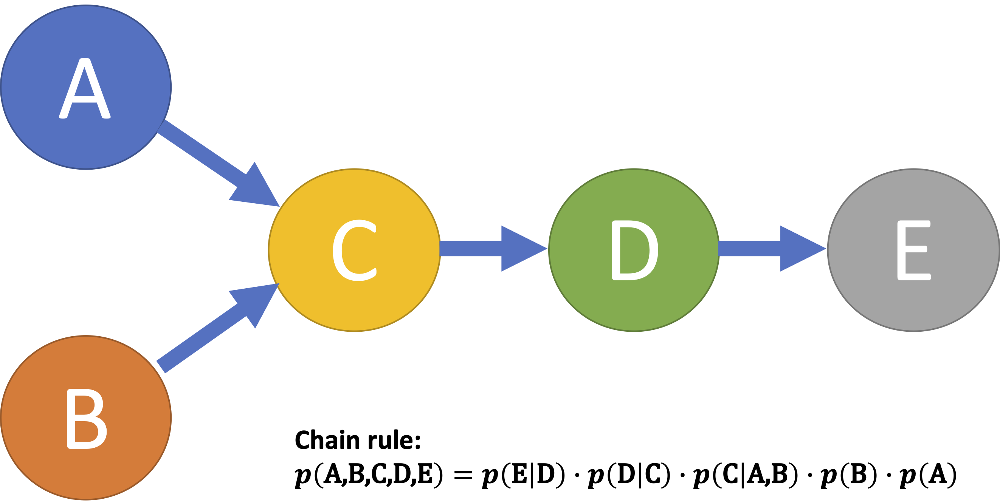
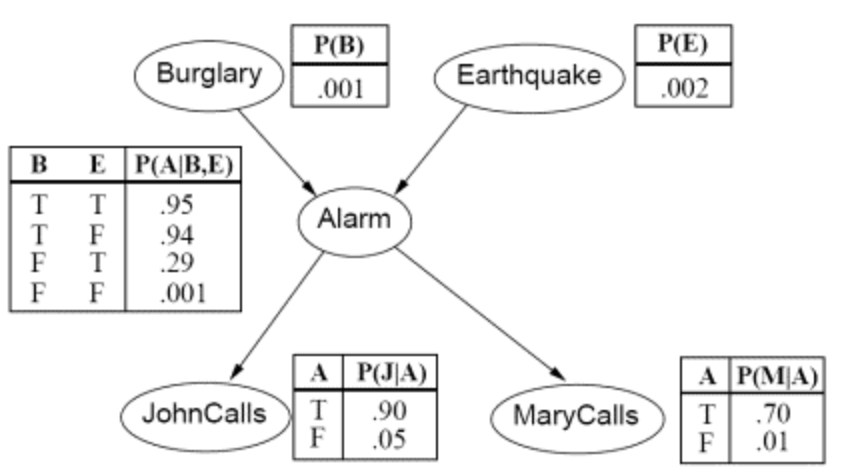

# Bayesian networks (a.k.a., Probabilities networks)
To represent and compute the outcome variable as conditionally dependent on a network of other variables

## Sample code and output:
* Sample code: <a href="./bnlearn_example.R">bnlearn R code example</a>

Variable | Meaning | Values
--- | --- | ---
A | Age | young for individuals below 30 years old, adult for individuals between 30 and 60 years old, and old for people older than 60.
S | Sex | male or female.
E | Education | up to high school or university degree.
O | Occupation | employee or self-employed.
R | Residence | the size of the city the individual lives in, recorded as either small or big.
T | Travel | the means of transport favoured by the individual, recorded either as car, train or other.

* DAG (Directed Acyclic Graph): 

* CPT (Conditional Probability Table) - main output:

R (Residence) | T (Travel) | O (Occupation)-emp | O (Occupation)-self
--- | --- | --- | ---
small | car | 0.48 | 0.56
small | train | 0.42 | 0.36
small | other | 0.10 | 0.08

R (Residence) | T (Travel) | O (Occupation)-emp | O (Occupation)-self
--- | --- | --- | ---
big | car | 0.58 | 0.70
big | train | 0.24 | 0.21
big | other | 0.18 | 0.09

## Concepts:
Term | Description
--- | ---
DAG (Directed Acyclic Graph) | Bayesian network does not allow cyclic representation (circular relationship), and it involves parent node => child node with a directed arrow, where the probability of the child node is a function of its parents
<a href="https://en.wikipedia.org/wiki/Chain_rule_(probability)">Chain rule</a> | For two events, p(A∩B) = p(B \| A) \* p(A) For 3+ events, p(An∩...∩A1) = p(An \| An-1∩...∩A1) \* p(An-1∩...∩A1), e.g.,, p(A∩B∩C) = p(A \| B∩C) \* p(B∩C)  
CPT (Conditional Probability Table) | 
 (<a href="https://cseweb.ucsd.edu/~elkan/250A/bayesnets.pdf">image source</a>)
Note: All the values in CPTs may not be directly calculated from other CPTs. They come from somewhere, such as domain expert.

## References:
* <a href="https://www.bnlearn.com/about/teaching/slides-bnshort.pdf">bnlearn.com slides</a>
* <a href="https://towardsdatascience.com/basics-of-bayesian-network-79435e11ae7b#:~:text=The%20probability%20value%20for%20each,is%20a%20representation%20of%20CPT.&text=Given%20a%20symptom%2C%20a%20Bayesian,particular%20disease%20causing%20the%20symptoms.">Basics of Bayesian networks</a>
* <a href="https://paulgovan.shinyapps.io/BayesianNetwork/">R Shiny Demo</a> (<a href="http://paulgovan.github.io/BayesianNetwork/">details</a>) 
