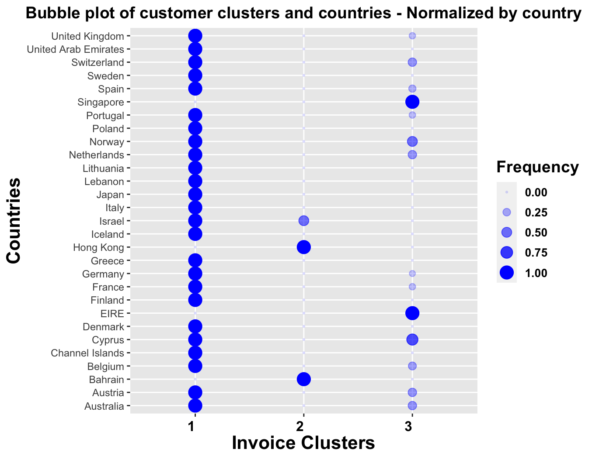
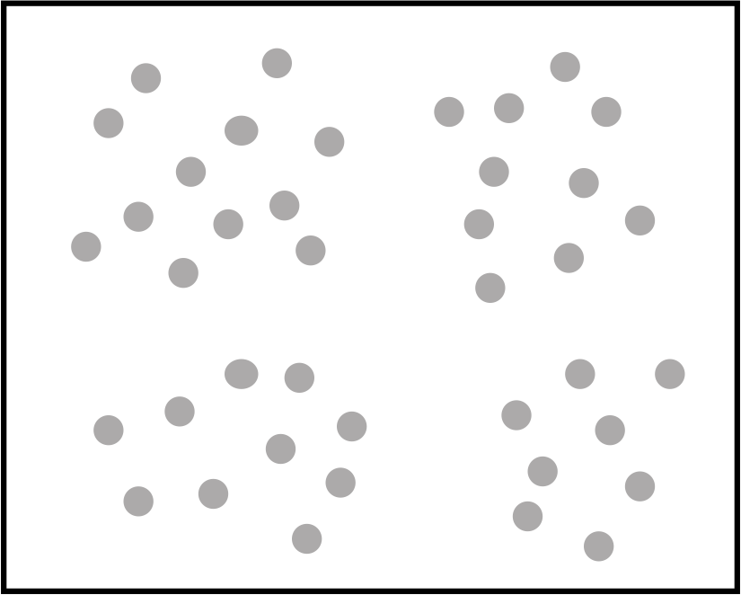
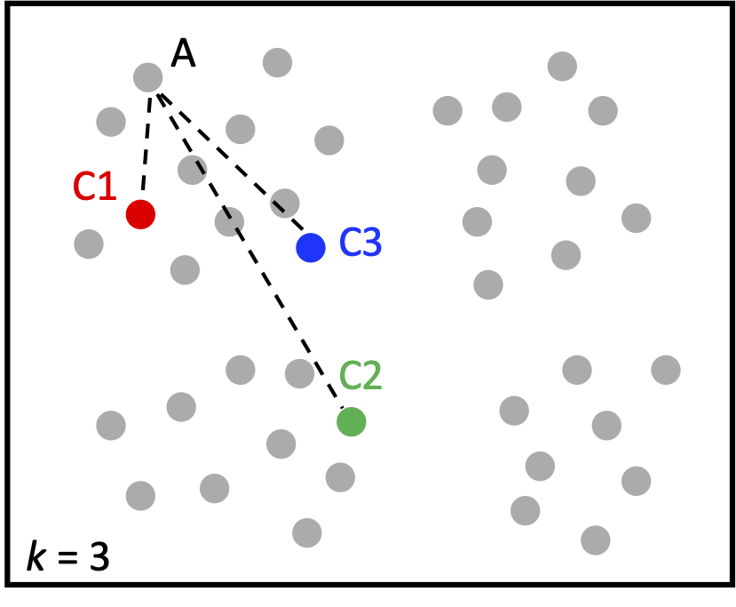
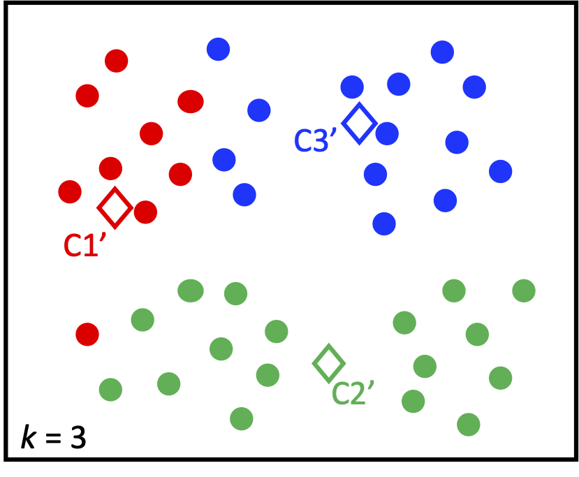
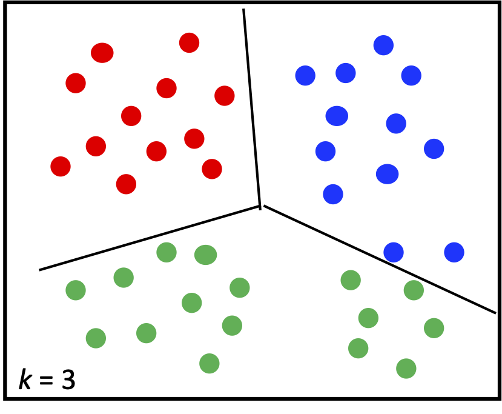
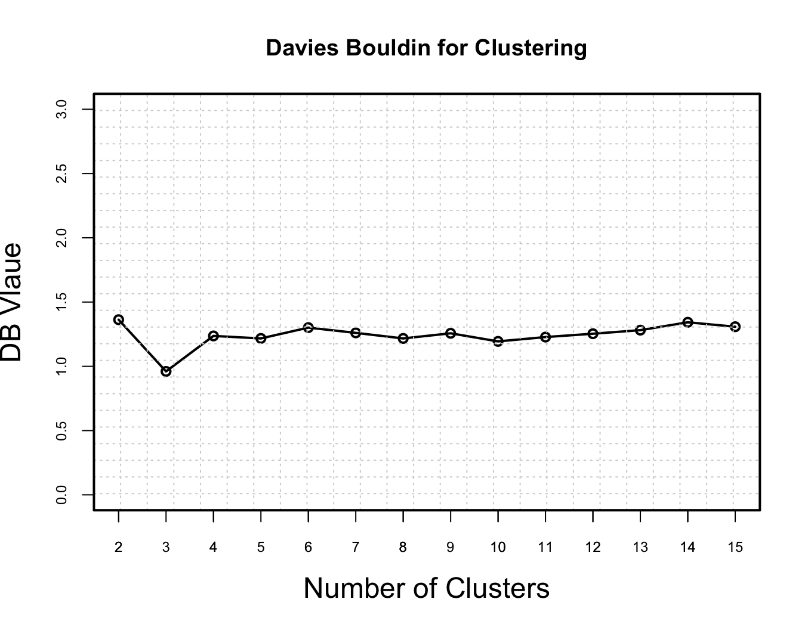
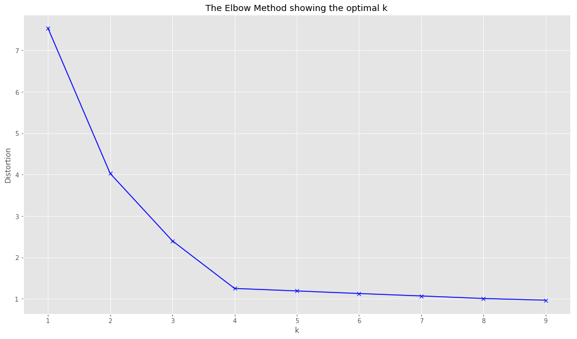
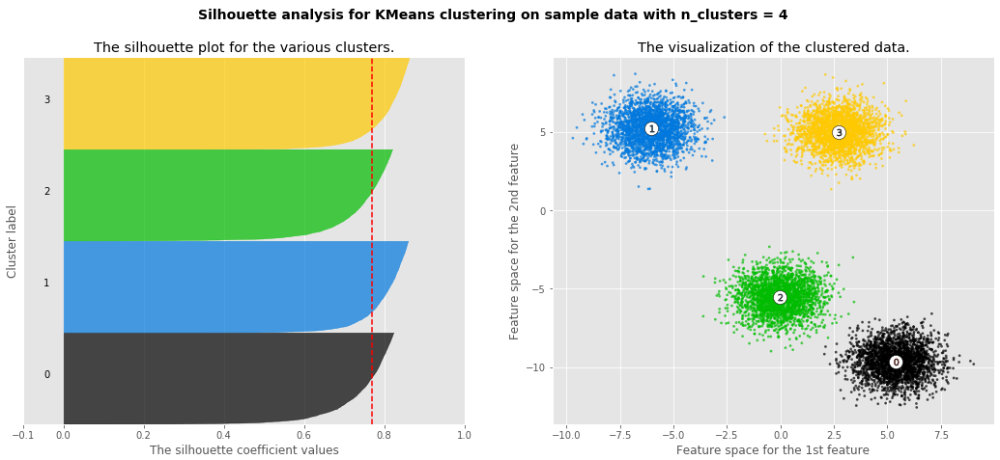

# Clustering
To see how customers' behaviors tend to group together

## Example of transactions data
The following bubble plot was generated using the <a href="https://archive.ics.uci.edu/ml/datasets/online+retail">UCI online retail dataset</a> and my <a href="./clustering.R">variation</a> of a <a href="https://rpubs.com/tahamokfi/Part1_AnalyzeTransactionData">clustering code</a> in R. The size of the bubble reflects the number of customers, and the cluster reflects the consuming habits of the customers.

## Concepts (k-means clustering)

Step#1 | Step#2 | Step#3 | Step#4
--- | --- | --- | ---
 |  |  | 
Goal: to assign to k clusters | Randomly pick k points as centers; Assign to nearest center  | Revise centers  as the means of points  | Repeat step#2 and #3 until convergence

## To determine the number of clusters
Method | Use | Examples
--- | --- | ---
<a href="https://en.wikipedia.org/wiki/Davies%E2%80%93Bouldin_index">Davies–Bouldin index</a> | The ratio of within-cluster distances to between-cluster distances.  With smaller within-cluster distances and bigger between-cluster distances, the DB value is lower, indicating better cluster solution | 

<a href="https://en.wikipedia.org/wiki/Elbow_method_(clustering)">Elbow method</a> | Plotting the explained variation as a function of the number of clusters | 

<a href="https://en.wikipedia.org/wiki/Silhouette_(clustering)">Silhouette method</a> [sil-oo-et] | A measure of how similar an object is to its own cluster (cohesion) compared to other clusters (separation).  That is, the similarity between a data point and points in the same cluster, compared to points outside of the cluster. | 

## References:
* k-means clustering: <a href="./k-means-clustering.py">Python code</a> and <a href="./k-means clustering.ipynb">Jupyter Notebook</a>
