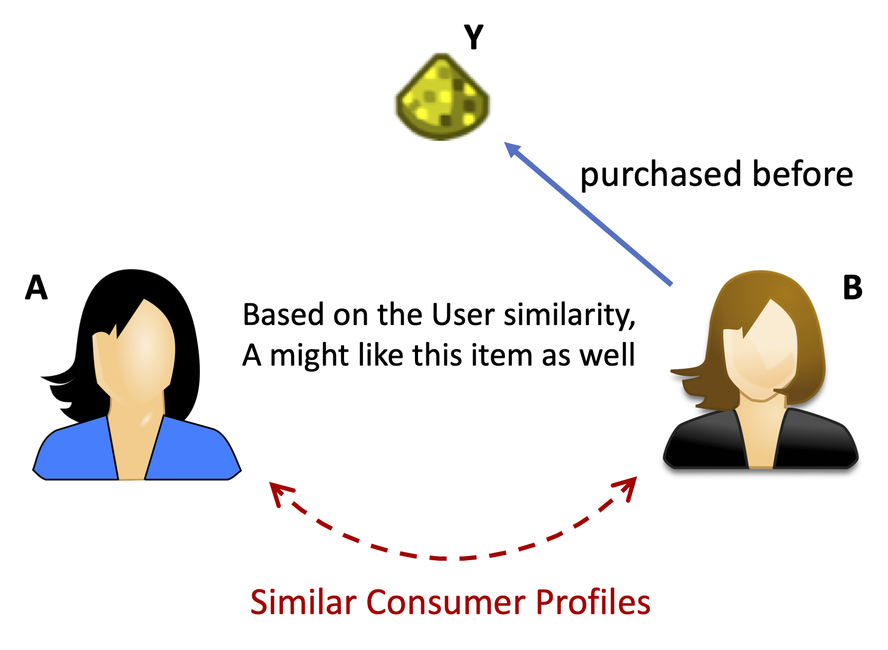
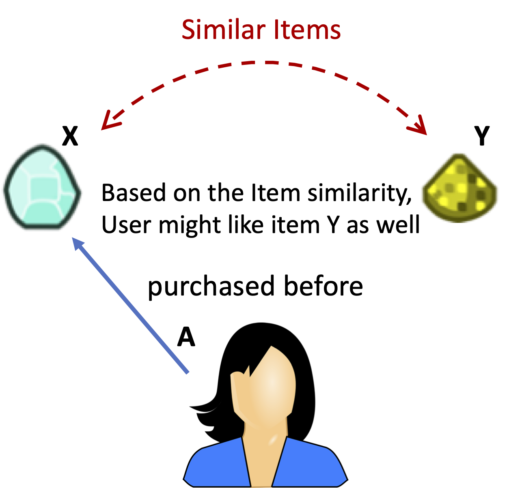
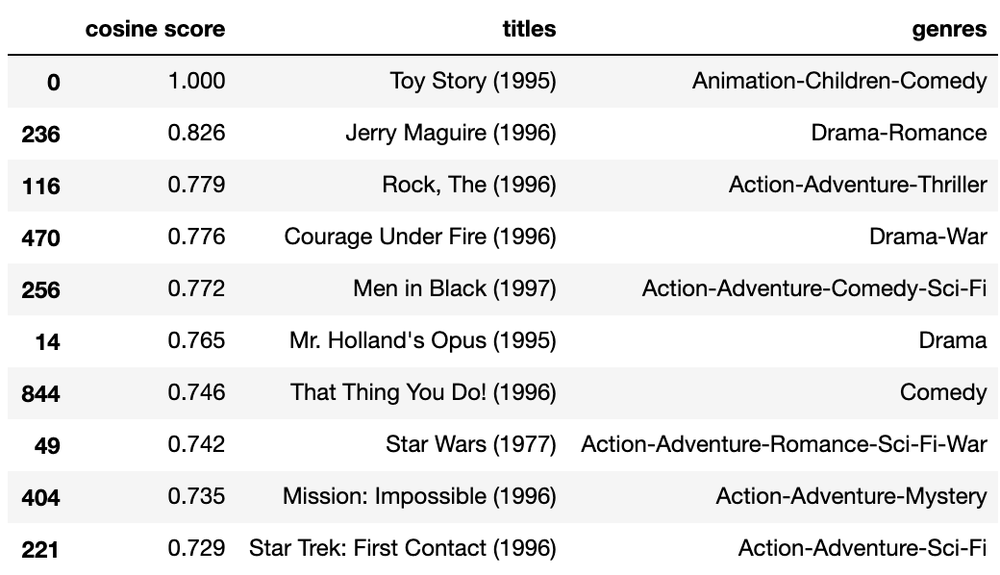
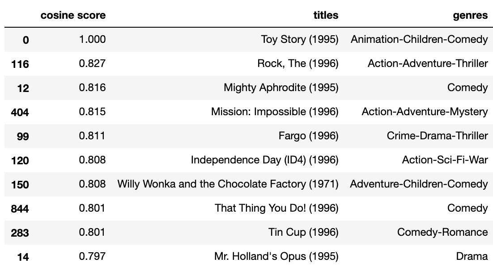
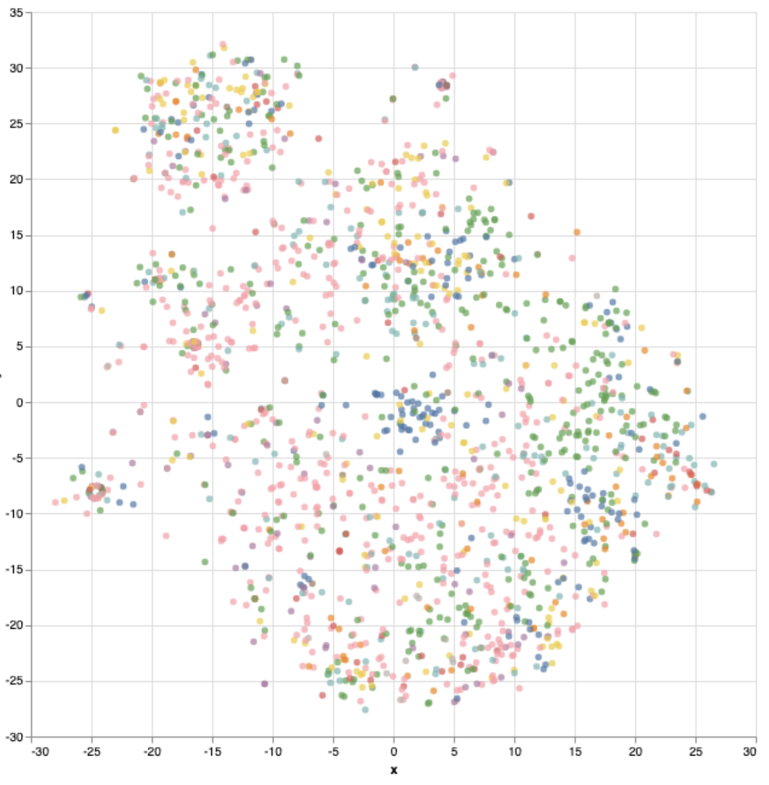
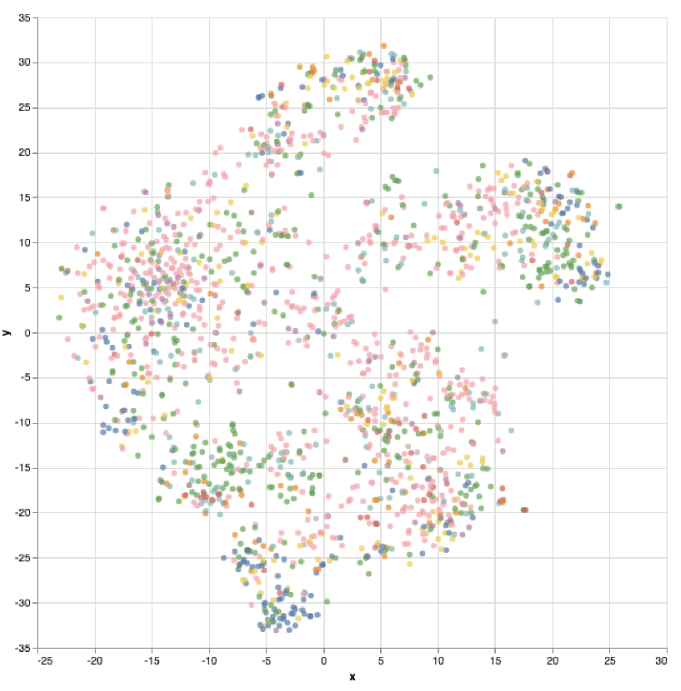
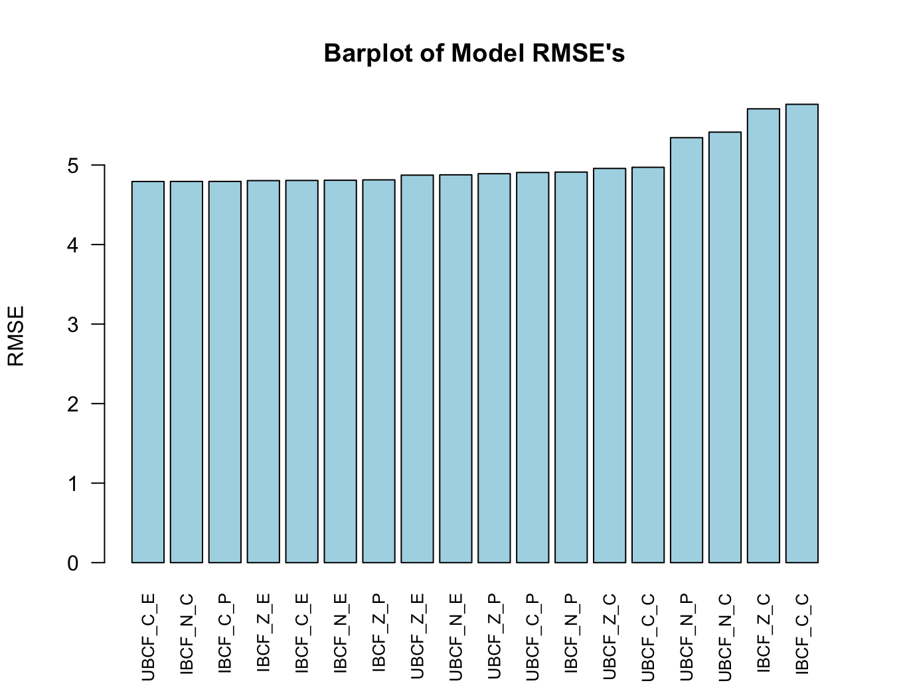

# Collaborative filtering
To <a href="../recommendation_system">recommend</a> an item to a buyer because (a) similar buyers previously purchased it and (b) the buyer previously purchased similar item(s).

## Concepts

Collaborative filtering model = User-based + Item-based | Illustration
--- | ---
User-based similarities | 

Item-based similarities | 

Note. A collaborative filtering model uses these two kinds of similarities <b>simultaneously</b> to provide recommendations, which addresses some limitations in <a href="../content-based_filtering">content-based filtering</a>.

## User-Item Interaction Matrix (aka. the feedback/rating matrix, or the embedding space)

cols \ rows | item 1 | item 2 | ... | item n
--- | --- | --- | --- | ---
user 1 | score (embedding) | score (embedding) | ... | score (embedding)
user 2 | score (embedding) | score (embedding) | ... | score (embedding)
... | ... | ... | ... | ...
user m | score (embedding) | score (embedding) | ... | score (embedding)

Note. This full matrix, A, has <i><a href="https://en.wikipedia.org/wiki/Zero_matrix">O</a></i>(nm) entries.

## Approach 1: <a href="https://en.wikipedia.org/wiki/Matrix_factorization_(recommender_systems)">Matrix Factorization</a> 

1. To decompose the user-item interaction matrix (aka. feedback matrix), A ∈ <i>&reals;</i>mxn, into the product of two lower dimensionality rectangular matrices U and V. - <b>U</b> ∈ <i>&reals;</i>mxd is the user embedding matrix. - <b>V</b> ∈ <i>&reals;</i>nxd is the item embedding matrix. The goal is to approximate the user-item interaction matrix, A, by UVT, while U and V have only <i><a href="https://en.wikipedia.org/wiki/Zero_matrix">O</a></i>((n+m)d) entries. 

2. To obtain U and V, we can use <a href="https://developers.google.com/machine-learning/recommendation/collaborative/matrix"><b>Weighted Matrix Factorization</b></a> (WMF) to build the objective function to minimize, which tends to have better generalization performance than <a href="https://en.wikipedia.org/wiki/Singular_value_decomposition"><b>Singular Value Decomposition</b></a> (SVD), because A may be very sparse. 

3. To minimize the objective function, we have two options: - <b>Stochastic Gradient Descent</b> (SGD) - <b>Weighted Alternating Least Squares</b> (WALS) (a preferred, specialized method for this purpose)

### Pros and Cons

- Pros: (a) Not requiring domain knowledge, (b) may learn from similar users, and (c) needing only the feedback matrix to start and can help with generating candidates quikcly

- Cons (matrix factorization): (a) <a href="https://en.wikipedia.org/wiki/Cold_start_(recommender_systems)">Cold-start problem</a>, (b) harder to include specific side features (any features beyond user ID or item ID, e.g., age range for a movie) (but see <a href="https://developers.google.com/machine-learning/recommendation/collaborative/summary">possible solutions</a>), and (c) popular items being recommended to everyone when using dot product.

## Approach 2: <a href="../DNN-softmax">Deep Neural Network: Softmax</a>

- This algorithm is to overcome some limitations in the matrix factorization method.

## Example 1 - Recommendation System (Movies)

<a href="./Recommendation_Systems-Movies.ipynb">Here</a> [ipynb] is my own version of recommendation systems (movies) using <a href="https://www.tensorflow.org/">tensorflow</a>.

The Python code is <a href="./Recommendation_Systems-Movies.py">here</a>.

### Results of "<b>Nearest neighbors of : Toy Story (1995)</b>"

Regularized matrix factorization | Deep neural network: Softmax
--- | ---
 | 

### Results of t-SNE of movie embeddings:

Legend: 

Regularized matrix factorization | Deep neural network: Softmax
--- | ---
 | 

## Example 2 - Jester Joke Dataset

Using the <a href="http://eigentaste.berkeley.edu/dataset/">Jester Datasets</a> of 24,938 users' ratings of 100 jokes, I compared the performance of 18 collaborative filtering models with my <a href="./jester_18CF.R">variation</a> of a <a href="https://rpubs.com/jt_rpubs/285729">R code</a>. The idea is to train the model using 80% of the data to learn the similarity between users or between items, and then to predict the unknown ratings by known ratings in the remaining 20% of the data. Evaluation of model performance was based on RMSE (root mean square error), as the ratings can range between (-10, 10).

The 18 models consist of the following:

Collaborative filtering model (2) | x | Data normalization (3) | x | Similarity metric (3)
--- | --- | --- | --- | ---
\* User-based (UBCF)  * Item-based (IBCF) | x | * No normalization (N) * Z-score normalization (Z) * Centering (C) | x | * Cosine similarity (C) * Euclidean distance (E) * Pearson's correlation (P)

The results of my analyses were slightly different from the previous R code, but note that my evaluation was based on 100% of the available data, whereas the previous R code used only 40% of the data, making my results more generalizable. My results showed the following:
* The best performing model was user-based collaborative filtering using centering-based normalization and a Euclidean distance similarity metric (UBCF_C_E), RMSE = 4.793;
* Of the item-based collaboartive filtering models, using the raw, non-normalized data and a cosine similarity metric (IBCF_N_C) appeared to have worked best, RMSE = 4.794.

## References

- Collaborative filtering can also be <a href="https://www.sciencedirect.com/science/article/abs/pii/S095741741500038X">supervised</a> learning.
- Recommendation system: Movies. Google Colab's  exercise (description: <a href="https://developers.google.com/machine-learning/recommendation/labs/movie-rec-programming-exercise">1</a> and <a href="https://developers.google.com/machine-learning/recommendation/labs/movie-rec-softmax-programming-exercise">2</a>)

