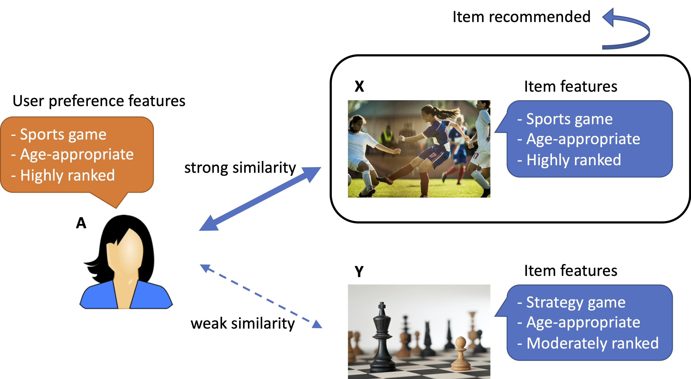

# Content-Based Filtering
To <a href="../recommendation_system">recommend</a> relevant items to the user, based on their previous actions (e.g., purchase) or explicit feedback (e.g., preference).

Disclaimer: this repository is based on my own research using various knowledge bases, including <a href="https://developers.google.com/machine-learning/recommendation/content-based/basics">Google's machine learning course</a>.

## Concepts

Note: The model makes user-specific recommendation <b>without</b> using any information from other users.

## Feature matrix

cols \ rows | feature 1 | feature 2 | ... | feature n
--- | --- | --- | --- | ---
item 1 | (0, 1) | (0, 1) | ... | (0, 1)
item 2 | (0, 1) | (0, 1) | ... | (0, 1)
... | ... | ... | ... | ...
item m | (0, 1) | (0, 1) | ... | (0, 1)

and

cols \ rows | feature 1 | feature 2 | ... | feature n
--- | --- | --- | --- | ---
user (only one) | (0, 1) | (0, 1) | ... | (0, 1)

Note: Here, the dot product between [the user embedding x] and [an item embedding y] gives the similarity measure.

## Pros and Cons

- Pros: (a) can make user-specific recommendations for large number of users quickly, even when other users do not share similar interests.

- Cons: (a) requiring human expert's domain knowledge of the features, and (b) difficult to expand beyond user's existing interests (these limitations may be addressed in <a href="../collaborative_filtering">collaborative filtering</a>)

## Reference

- https://developers.google.com/machine-learning/recommendation/content-based/basics
