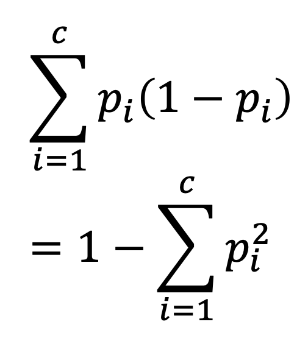
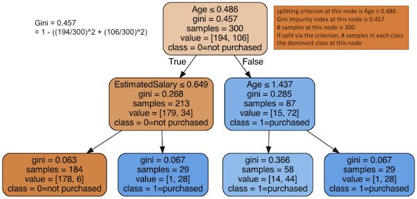

# Decision tree
To predict consumer's purchasing decision via asking a series of questions honing in the final answer

## Online Demo

<a href="./DT_Purchasing.ipynb">Classification of user purchasing (yes/no) using age and estimated salary</a>

## Concepts

An analogy of decision trees is the <a href="https://en.wikipedia.org/wiki/Twenty_Questions">20 Questions</a> game, where a questioner can ask an answerer 20 yes/no questions to guess what the answerer is thinking of. A simplified version is to guess a number between 1-100. The questioner would ask a series of questions: is it larger than 50? is it larger than 75? is it larger than 87.5? and so on, until the questioner can tell the answer with increased certainty.

In ML, the process of a decision tree is to <b><i>recursively</i></b> split down from the root node to one of the leaf/terminal nodes, with every node acting as a test case for making <b><i>increasingly more certain/accurate</i></b> decisions based on the values of predictors.

Criterion | Equation | Descriptions | Comparison | Used in Algorithm
--- | --- | --- | --- | ---
<a href="https://en.wikipedia.org/wiki/Decision_tree_learning#Gini_impurity">Gini index of impurity</a> | 

<i>p</i>i is the proportion of samples belonging to class <i>c</i> for a particular node | * Gini impurity, <b>the likelihood of misclassifying a new instance, if that new instance were randomly classified according to the distribution of class labels from the data set</b>;  For example, # sample = 300, after splitting, 194 are y=0 and 106 are y=1, then Gini impurity = (194/300)\*(106/300) + (106/300)\*(194/300) = 1 - ((194/300)^2 + (106/300)^2) = 0.457;  * 1 ≥ Gini index ≥ 0; The degree of Gini index varies between 0 and 1, where 0 denotes that all elements belong to a certain class or if there exists only one class, and 1 denotes that the elements are randomly distributed across various classes. <a href="https://www.geeksforgeeks.org/gini-impurity-and-entropy-in-decision-tree-ml/">A Gini Index of 0.5</a> denotes equally distributed elements into two (or some) classes;  * Gini = 0 is good, 1 is bad | * Favors larger partitions * Used in classification | * <a href="https://en.wikipedia.org/wiki/Decision_tree_learning">CART</a>
Entropy | 

 | * Entropy is how much randomness/guessing it'd require to determine the class, and Entropy ≥ 0; * Entropy decrease is information gain; how well the value of predictor can separate the training samples with respect to the target class; * Entropy = 0 is good, >0 is bad (entropy can be >1) | * Favors smaller partitions with distinct values * Used in classification | * <a href="https://en.wikipedia.org/wiki/ID3_algorithm">ID3</a> and its extension <a href="https://en.wikipedia.org/wiki/C4.5_algorithm">C4.5</a>
Variance Reduction | 

 | * Among all possible splits to split the population, the one with lower variance is selected | * Used in regression | ---
 

 

## Process of generating a tree

The root node is the entire training set. The values of the predictor is binarized. The node will keep splitting until its Gini index or Entropy ≈ 0, that is, requiring little or no uncertainty to determine the class.

Here is a max_depth=2 decision tree example of predicting Purchased by Age and Estimated Salary using the Gini index:

Note 1: A node of lighter color indicates higher impurity, which requires further splitting

Note 2: <i>Value</i> indicates how the sample would be split if the node were the last node

Here is a max_depth=4 decision tree example of predicting iris class using the Entropy index:

## Reducing over-fitting in decision trees

Method | Descriptions
--- | ---
<a href="https://en.wikipedia.org/wiki/Random_forest">Random Forest</a> | * An ensemble method. * The training set is randomly sampled, and the features used to split nodes are also randomly sampled. * The sampling method includes <b>bagging</b> and <b>boosting</b>.

Pruning | * Split the actual training set into two sets, T1 and T2. * Prepare the tree using T1 and prune the tree to optimize the accuracy of the validating set T2
AdaBoost | <a href="https://en.wikipedia.org/wiki/AdaBoost#:~:text=AdaBoost%2C%20short%20for%20Adaptive%20Boosting,learning%20algorithms%20to%20improve%20performance.">Adaptive Boosting</a>

