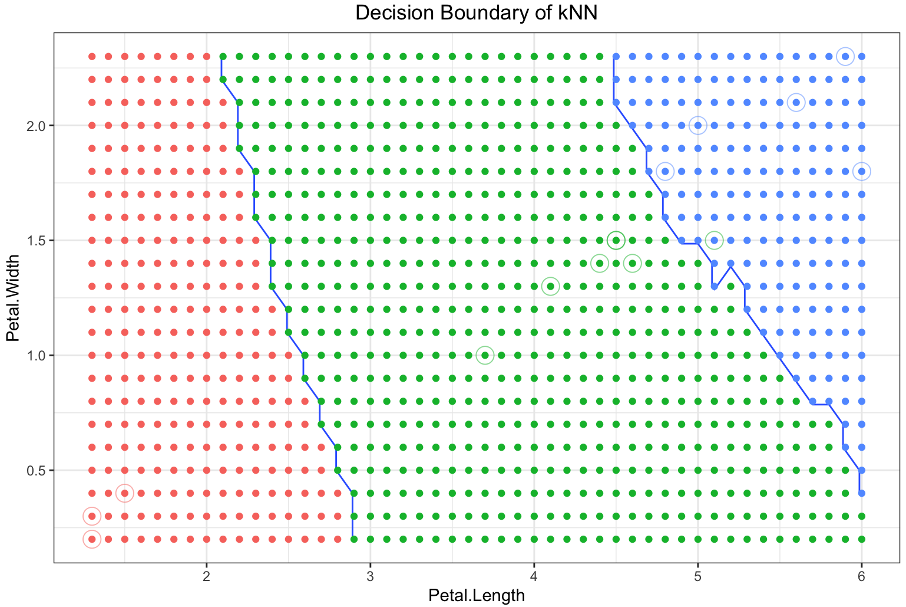

# k-Nearest Neighbors
Birds of the same feather are expected to flock together

## Examples:
* <a href="./kNN-examples.R">R code</a> to classify/predict a flower into species of <a href="https://stat.ethz.ch/R-manual/R-devel/library/datasets/html/iris.html">iris</a> [virginica, Versicolor, or setosa] by [petal.length, sepal.length, petal.width and sepal.length].

* <a href="./kNN-examples.R">R code</a> to classify/predict a <a href="https://ggplot2.tidyverse.org/reference/diamonds.html">diamond</a> into quality of the cut [Fair, Good, Very Good, Premium, Ideal] by [carat, depth, table, price, x, y, z].

## Basic Concept

An object is assigned to the class most common among its k nearest neighbors. For example, if the neighbors based on some values of predictors all like to buy product X, we will predict that the new customer would also like to buy product X.

## Classification Steps

Example: to classify a new sample

Step#1 | Step#2 | Step#3
--- | --- | ---
 |  | 

## How to pick the right k?

* Use a <a href="https://www.analyticsvidhya.com/blog/2018/03/introduction-k-neighbours-algorithm-clustering/">validation error curve</a> to pick k.
* A common practice is to use the square root of the number of features as the starting point to select k.

## References:
* <a href="./kNN-iris.ipynb">Jupyter Notebook example using the UCI iris dataset</a>.
