# Linear Regression
To explain quarterly sales via other explanatory variables

## Examples

Example | Details
--- | ---
Simple Linear Regression | To explain sales via the budget of youtube and facebook advertising, respectively: <table><tr><td>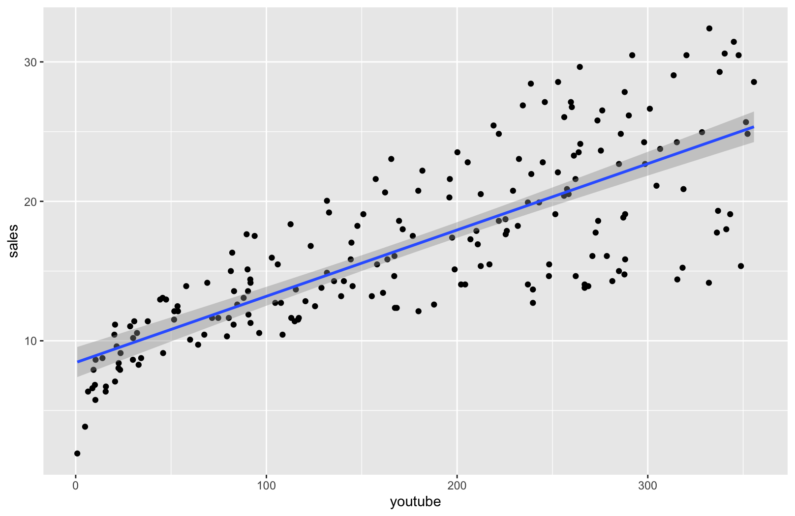</td><td>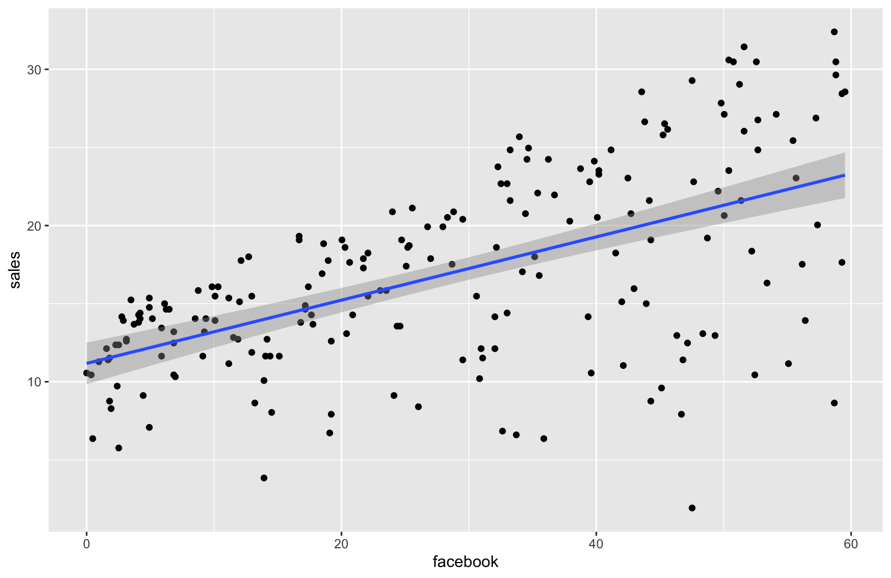</td></tr></table>
Multiple Linear Regression | Here are the comprehensive <a href="./multiple_regression.md">results</a> of my <a href="./linear_regression.R">R code</a> that run a multiple linear regression of sales on the budget of three advertising medias (youtube, facebook and newspaper)

## Models

Model | Hypothesis, hθ(x) | Notes
--- | --- | ---
Simple Linear Regression | θTx = θ0x0 + θ1x1 Conventionally, x0 = 1 | assumes linearity in the relationship between x and y, and <a href="https://en.wikipedia.org/wiki/Independent_and_identically_distributed_random_variables">I.I.D.</a> in residuals
Multiple Linear Regression | θTx = θ0x0 + θ1x1 + θ2x2 + ⋯ + θnxn Conventionally, x0 = 1 | all assumptions in simple linear regression, while also assuming little or no multicollinearity
Polynomial Regression | <table><tr><th>Function</th><th>Math Expression, y ~ f(x,θ)</th></tr><tr><td>Quadratic</td><td>θ0x0 + θ1x1 + θ2〖x1〗2</td></tr><tr><td>A "circle"</td><td>θ0x0 + θ1x1 + θ2x2 + θ3〖x1〗2 + θ4〖x2〗2</td></tr><tr><td>Cubic</td><td>θ0x0 + θ1x1 + θ2〖x1〗2 + θ3〖x1〗3</td><tr><td>Square root</td><td>θ0x0 + θ1x1 + θ2〖x1〗0.5</td></tr><tr><td>Other higher-order polynomial func</td><td>θ0x0 + θ1x1 + θ2x2 + θ3x1x2 <i>etc.</i></td></tr></table>Conventionally, x0 = 1 | considered linear regression since it is linear in the regression coefficients, although the decision boundary is non-linear

## Estimation of coefficients/parameters

Method | Details
--- | ---
To minimize cost function | 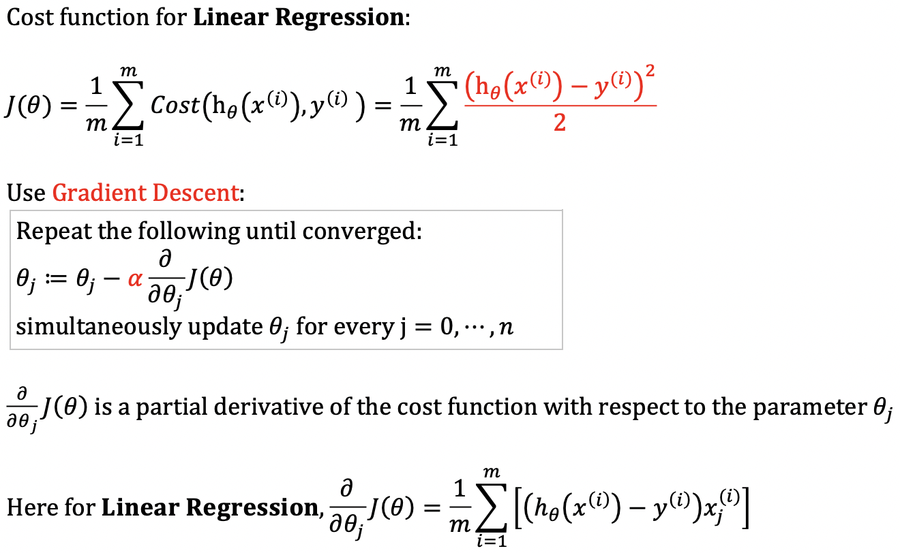
To compute analytically with <a href="http://mlwiki.org/index.php/Normal_Equation">normal equation</a> | 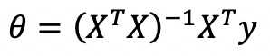 X transpose times X inverse times X transpose times Y

## Interpretation of coefficients

Coefficient | Interpretation
--- | ---
Unstandardized | It represents the amount by which dependent variable changes if we change independent variable by one unit keeping other independent variables constant.
Standardized | The standardized coefficient is measured in units of standard deviation (both X and Y). A beta value of 1.25 indicates that a change of one standard deviation in the independent variable results in a 1.25 standard deviations increase in the dependent variable.

## Regularized linear regression

Model | Penalty | Description
--- | --- | ---
<a href="https://en.wikipedia.org/wiki/Lasso_(statistics)">Lasso regression</a> (To simplify model) | L1 norm: 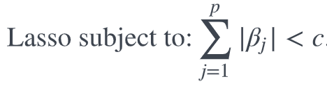 | * To shrink some of the coefficients to exactly 0; * This leads to a sparse model (having many β's = 0), helping with interpretability
<a href="https://en.wikipedia.org/wiki/Tikhonov_regularization">Ridge regression</a> (To handle multicollinearity)   it is named "ridge" because the matrix form of <i>Ip</i> looks like a ridge | Using **L2 Regularization Technique:**  Adding “squared magnitude” of coefficient (squared L2 norm) as a penalty term to the cost function when there is multicollinearity among X's (which leads to <a href="https://en.wikipedia.org/wiki/Multicollinearity">overfitting of the data</a>): 
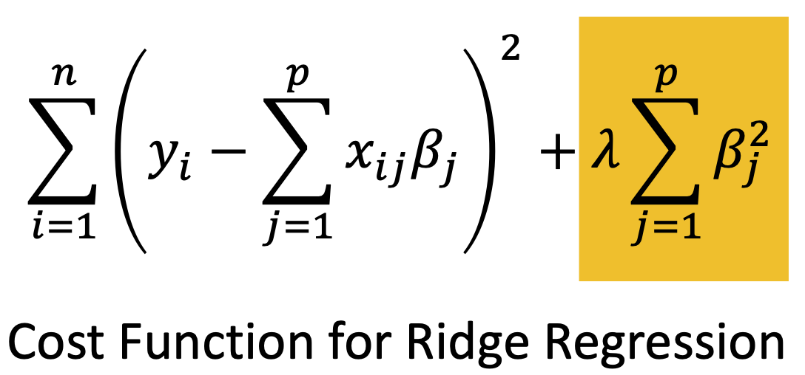
 Reference: L2 norm: 
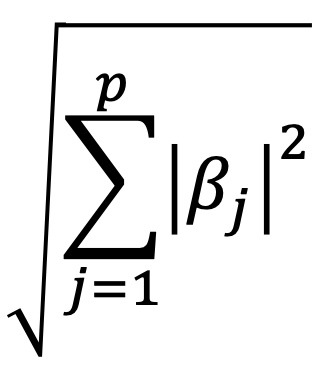
 <a href="https://stats.stackexchange.com/questions/160096/what-are-the-differences-between-ridge-regression-using-rs-glmnet-and-pythons">R's glmnet(alpha=0)</a> and minimize this objective function: 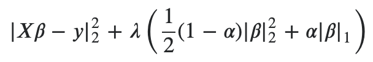  <a href="https://scikit-learn.org/stable/modules/generated/sklearn.linear_model.Ridge.html">sklearn's Ridge()</a> and minimize this objective function: \|\|y - Xw\|\|^2_2 + alpha * \|\|w\|\|^2_2  <a href="https://www.statsmodels.org/stable/generated/statsmodels.regression.linear_model.OLS.fit_regularized.html">statsmodels' OLS.fit_regularized(L1_wt=0.0)</a> and minimize this insteead: 0.5\*RSS/n + 0.5\*alpha\*\|params\|^2_2  | * **Multicollinearity** may give rise to large variances of the coefficient estimates, which can be reduced by ridge regression;  * When (XTX)-1 does not exist, (XTX) being singular; * Recall, the LS estimator: 
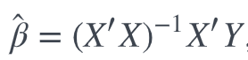
* Such <b>non-invertibility</b> is due to (a) multicollinearity, or (b) # predictors > # observations; * To fix, use: 

<a href="https://en.wikipedia.org/wiki/Elastic_net_regularization">Elastic net</a> | Lasso L1 penalty + Ridge L2 penalty | ---

### Example: Ridge Regression

λ is the only parameter to adjust. When λ increases, coefficients tend to shrink but MSE tends to increase (see graphs below). Thus, there exists a sweet spot where coefficients shrink and MSE is also the lowest. Because the implementations in R and Python are different, the coefficients across different implementations may not be directly comparable; however, the MSE/RMSE/R2 are comparable.

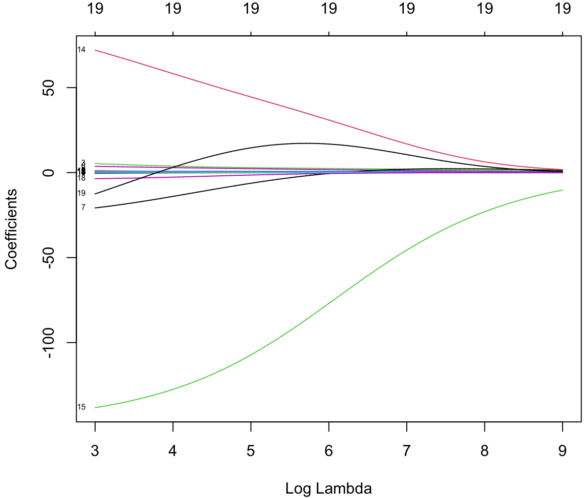 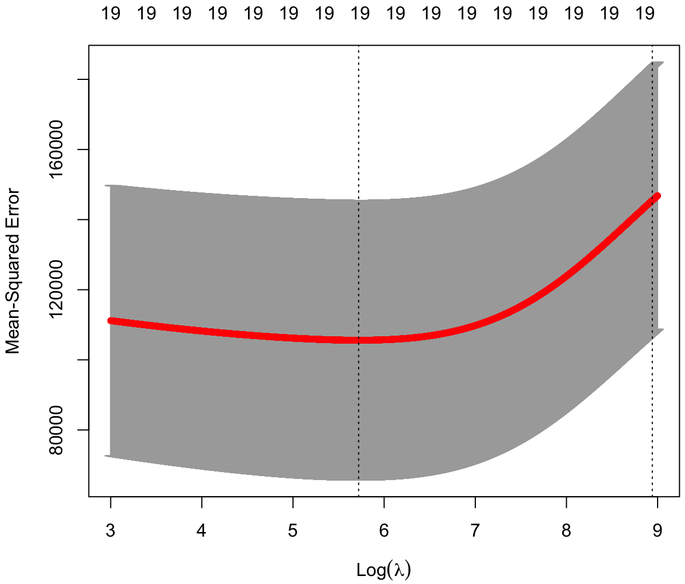

Model performance with <a href="./regularized_linear_regression.R">the testing set</a> | Linear regression | Ridge regression | Lasso
--- | --- | --- | ---
RMSE | 418.3987| 374.5406 | 380.2771
R2 | 0.2209 | 0.3757 | 0.3564
Coefficient | 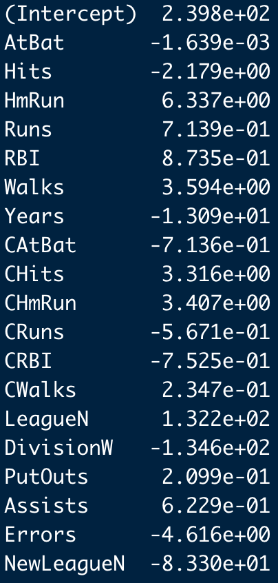 | 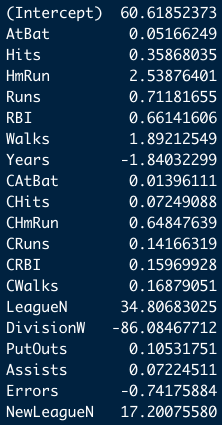 | 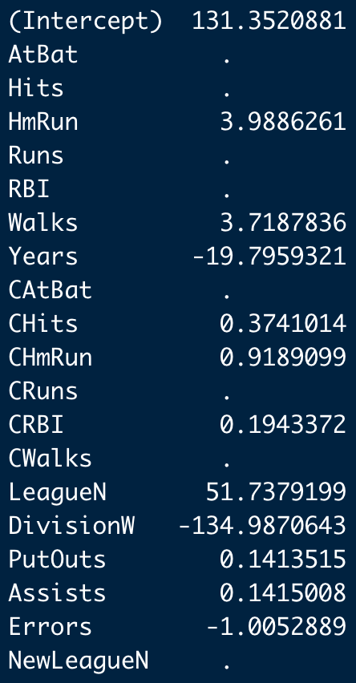

Compared to linear regression, both ridge and lasso regression appear to have improved the model performance.

My own codes: <a href="./regularized_linear_regression.R">R</a> and <a href="./regularized_linear_regression.py">Python</a>
