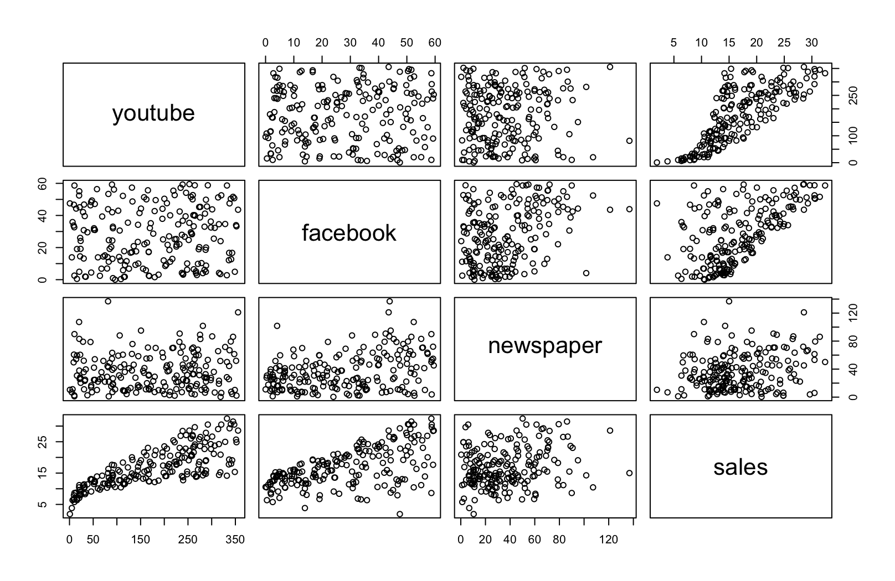

## 1. Inspect data: Create Scatter plots between all the variables to inspect correlations

<p align="center"></p>

#### Corrleation matrix:

```
             youtube   facebook  newspaper     sales
youtube   1.00000000 0.05480866 0.05664787 0.7822244
facebook  0.05480866 1.00000000 0.35410375 0.5762226
newspaper 0.05664787 0.35410375 1.00000000 0.2282990
sales     0.78222442 0.57622257 0.22829903 1.0000000
```

<hr>

## 2. Estimate unstandardized coefficients

#### Method 2-1: R function of lm() (Fitting Linear Models) from the stats package in R

Code:
```
lm(sales ~ youtube + facebook + newspaper, data = marketing)
```

Output:
```
Call:
lm(formula = sales ~ youtube + facebook + newspaper, data = marketing)

Residuals:
     Min       1Q   Median       3Q      Max 
-10.5932  -1.0690   0.2902   1.4272   3.3951 

Coefficients:
             Estimate Std. Error t value Pr(>|t|)    
(Intercept)  3.526667   0.374290   9.422   <2e-16 ***
youtube      0.045765   0.001395  32.809   <2e-16 ***
facebook     0.188530   0.008611  21.893   <2e-16 ***
newspaper   -0.001037   0.005871  -0.177     0.86    
---
Signif. codes:  0 ‘***’ 0.001 ‘**’ 0.01 ‘*’ 0.05 ‘.’ 0.1 ‘ ’ 1

Residual standard error: 2.023 on 196 degrees of freedom
Multiple R-squared:  0.8972,	Adjusted R-squared:  0.8956 
F-statistic: 570.3 on 3 and 196 DF,  p-value: < 2.2e-16
```

<hr>

#### Method 2-2: Normal equation

Code:
```
solve( t(X) %*% X ) %*% t(X) %*% Y
```

Output:
```
                 sales
           3.526667243
youtube    0.045764645
facebook   0.188530017
newspaper -0.001037493
```

<hr>

## 3. Estimate standardized coefficients

#### Method 3-1: R function of lm.beta() from the QuantPsyc package in R

Code:
```
model <- lm(sales ~ youtube + facebook + newspaper, data = marketing)
lm.beta(model)
```

Output:
```
     youtube     facebook    newspaper 
 0.753065912  0.536481550 -0.004330686
```

<hr>

#### Method 3-2: Normal equation

Code:
```
X_scaled <- subset( scale(X), select=c(youtube,facebook,newspaper)) # remove the intercept term
Y_scaled <- scale(Y)
solve( t(X_scaled) %*% X_scaled ) %*% t(X_scaled) %*% Y_scaled
```

Output:
```
                 sales
youtube    0.753065912
facebook   0.536481550
newspaper -0.004330686
```

<hr>

## 4. Data source and code

- Data source: <a href="https://cran.r-project.org/web/packages/datarium/index.html">Data Bank for Statistical Analysis and Visualization</a>
- Code: My <a href="./linear_regression.R">code</a> in R
