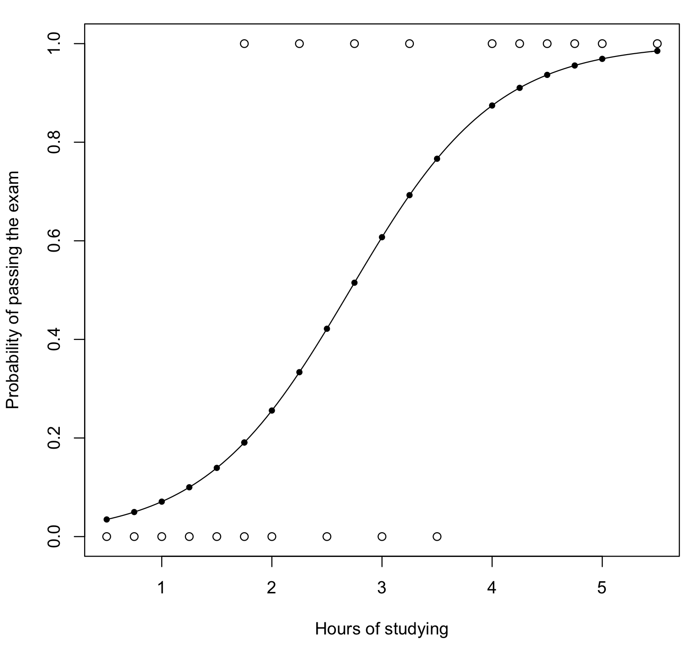

# <a href="https://en.wikipedia.org/wiki/Logistic_regression">Logistic Regression</a>
To predict yes or no in the target variable

## <a href="https://en.wikipedia.org/wiki/Logistic_regression#Latent_variable_interpretation">Fundamental interpretation: the odds as an exponential function of the predictor</a>

* DV = Odds of P(OutcomePositive) = P(OutcomePositive) / P(OutcomeNegative)
* IV = Predictor in terms of β0 + β1\*x
* Fundamental Relationship: <a href="https://danielyang.shinyapps.io/Logistic_Regression/">DV = <i>e</i>IV</a>

Related considerations:
* Interesting property: the derivative of DV is also <i>e</i>IV</a>, that is, whether DV is already very high, slight increase in IV will exponentially make DV much higher. For example, if you've already studied for 5 hours, studying for another 30 minutes will <a href="https://danielyang.shinyapps.io/Logistic_Regression/">make the Odds of P(passing) much, much higher</a>.
* Important value to consider: what IV will lead to DV≥1? Ans: When x≥(-β0/β1)

No. | Assumptions
--- | ---
1 | Dependent Variable is binary or ordinal
2 | Observations are independent of each other
3 | Little or no multicollinearity among the independent variables
4 | **Linearity of independent variables (the x) and log odds (the z)**
5 | A large sample size. It needs at minimum of 10 cases with the least frequent outcome for each independent variable in your model.

No. | It does not require the following
--- | ---
1 | It does not need a linear relationship between the dependent and independent variables.
2 | The error terms (residuals) do not need to be normally distributed.
3 | Homoscedasticity is not required.
4 | The dependent variable is not measured on an interval or ratio scale.

Example:

### 1. Passing exam

* Raw Data: <a href="./Examples/Passing-exam/Passing-exam.csv">CSV</a>; <a href="./Examples/Passing-exam/Passing-exam.sav">SPSS SAV</a>
* Python: <a href="./Examples/Passing-exam/Passing-exam.py">Python Code</a>; <a href="./Examples/Passing-exam/Passing-exam.py.output">Python Output</a>
* R: <a href="./Examples/Passing-exam/Passing-exam.R">R Code</a>; <a href="./Examples/Passing-exam/Passing-exam.R.output">R Output</a>

The `sigmoid function` or `logistic function`: y = 1/(1+e`-z`), where z=β0+β1\*x; Notice that there is a **negative** sign before z, which is very important.
For example, let's say β0 = -4.077, β1 = 1.5046

Studying hours (x) | z=β0+β1\*x | Probpass =y=p=1/(1+e`-z`) | Probfail =q=(1-y)=(1-p) | odds(y) =(probpass)/(probfail) =y/(1-y)=p/q=ez
--- | --- | --- | --- | ---
1 | **-2.5724** | 0.07 | 1-0.07 = 0.93 | 0.07/0.93 = 0.08 
2 | **-1.0678** | 0.26 | 1-0.26 = 0.74 | 0.26/0.74 = 0.34
3 | **0.4368** | 0.61 | 1-0.61 = 0.39 | 0.61/0.39 = 1.55
4 | **1.9414** | 0.87 | 1-0.87 = 0.13 | 0.87/0.13 = 6.97
5 | **3.446** | 0.97 | 1-0.97 = 0.03 | 0.97/0.03 = 31.37

odds(y) =(probpass)/(probfail) =y/(1-y)=p/q=ez | log odds = logit func ln(odds(y))=ln(p/q)=z | odds ratio (OR)  = eβ1
--- | --- | ---
0.08 | **-2.5724** | 0.08/0.02=4.50, where 0.02=eβ0
0.34 | **-1.0678** | 0.34/0.08=4.50
1.55 | **0.4368** | 1.55/0.34=4.50
6.97 | **1.9414** | 6.97/1.55=4.50
31.37 | **3.446** | 31.37/6.97=4.50

odds(y)=p/q=ez=eβ0+β1\*x

## Explaining odds ratio

**odds ratio** = odds(y with x+1) / odds(y with x) = eβ1, that is, for every 1-unit increase in x, the odds of y will be multiplied by eβ1.

For example, given β1 = 1.5046, e1.5046=4.50, it means that every 1 more hr of studying will increase the odds of passing versus failing by a **constant** multiplication factor of 4.50.

Note that <a href="https://www.quora.com/Why-is-the-exponential-function-always-positive">the exponential function is always positive</a>, but if β1<0, 0<eβ1<1, it means every 1-unit increase in x, the odds of y will be multipled by a factor<1

For example, if β1=-0.05, it means odds ratio = e-0.05=0.95, so for every 1-unit increase in x, the odds of P(Outcomepositive) versus P(Outcomenegative) will decrease by 5%. Another example, if β1=-0.17, it means odds ratio = e-0.17=0.84.

Note. If X (the predictor) is binary, the odds ratio = ad/bc in a contingency table. For example:

Actual \ Study | Having studied (1) | Didn't study (0)
--- | --- | ---
Actual Pass (1) | a | b
Actual Fail (0) | c | d

β1 = ln(ad/bc), odds ratio (OR) = eβ1 = ad/bc.

## Explaining y (probpass) as a function of z (log odds), the logistic/sigmoid function:

## Explaining z (log odds) as a function of y (probpass), the logit function:

No. | <a href="https://www.quora.com/What-are-alternatives-to-logistic-regression">Alternatives to logistic regression</a>
--- | ---
1 | Support Vector Machine
2 | Decision Trees and Ensembled-based classifier
3 | Naive Bayesian

Reference: https://www.quora.com/What-are-the-pros-and-cons-of-using-logistic-regression-with-one-binary-outcome-and-several-binary-predictors

Pros | Logistic regression
--- | ---
1 | Directly interpretable (conditional probabilities)
2 | Easy to implement
3 | Very efficient/fast to train
4 | Can serve as a benchmark to compare to more complex algorithms

Cons | Logistic regression
--- | ---
1 | As a generalized linear model, it cannot solve non-linear hypothesis-space/decision-boundary problems (a decision tree would be better here)
2 | Cannot solve non-categorical dependent variables

## Regularized logistic regression

- https://machinelearningmedium.com/2017/09/15/regularized-logistic-regression/
 
