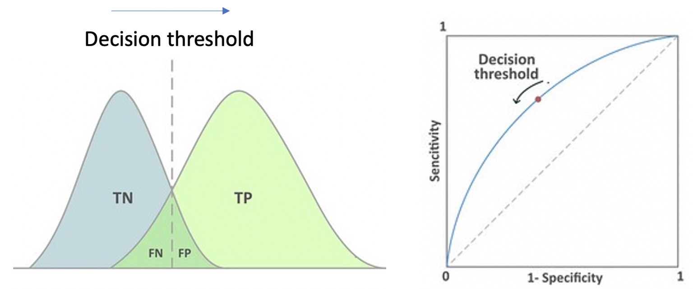
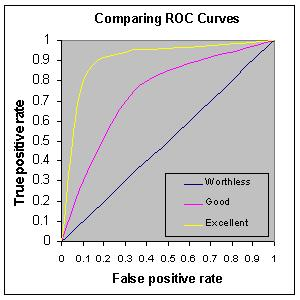
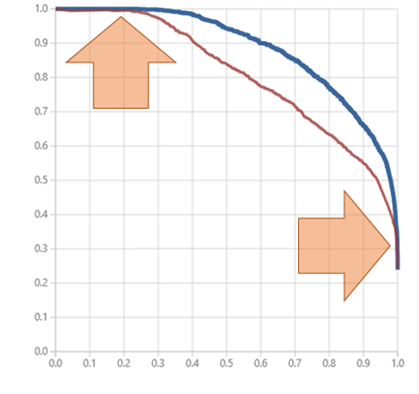

# Model Evaluation
Covering the basics of how to evaluate model performance

 

## Regression

Metrics | Measuring | Features or interpretation
--- | --- | ---
RMSE (Root Mean Square prediction Error) | Error | <a href="https://medium.com/human-in-a-machine-world/mae-and-rmse-which-metric-is-better-e60ac3bde13d">Penalizing large errors</a>
MSE (Mean Squared Error) | Error  | Penalizing large errors, as in RMSE
MAE (Mean Absolute Error) | Error | Easy to interpret
η2, Ω2, Cohen's *f*2 | effect size | ---
R2 | goodness-of-fit | ---
Adj. R2 | R2 that has been adjusted for the number of predictors in the model | ---
<a href="https://methodology.psu.edu/AIC-vs-BIC">AIC (Akaike Information Criterion), BIC (Bayesian Information Criterion)</a>  | Trade-off between goodness of fit and model simplicit | The lower, the better
Outliers | Diagnostic | ---
Residual plot | Diagnostic | y = residual, x = predictor, to see non-random pattern, which may indicate a non-linear relationship, heteroscedasticity, or left over from series correlation
QQ plot | Diagnostic | How well the distribution of residuals fit the normal distribution
Multicollinearity test | Diagnostic	| ---

## <a href="https://stats.stackexchange.com/questions/34193/how-to-choose-an-error-metric-when-evaluating-a-classifier">Classification</a>

<a href="http://www.dataschool.io/roc-curves-and-auc-explained/">AUC</a> (Area Under Curve) of the ROC curve

- ROC curve is a plot of Power (1-β; Recall) as a function of α (that is, 1-specificity)
- AUC measures the performance of a binary classifier **averaged across all possible decision thresholds (0.0 – 1.0)**; when decision threshold (cut-off score of y probability for class=1 vs. class=0) increases and α likely decreases  (going left on the x-axis of the ROC plot), less false positive but also less true positive

 (<a href="https://towardsdatascience.com/fine-tuning-a-classifier-in-scikit-learn-66e048c21e65">image source</a>)

 (<a href="http://arogozhnikov.github.io/2015/10/05/roc-curve.html">website reference</a>)

- For a random classifier, it will be right/wrong 50% of the time, thus half predictions would be true/false positives, thus the diagonal line
- AUC can be converted to the Gini index, which is 2\*AUC-1
- AUC can be interpreted as predictive power

 

 (<a href="http://gim.unmc.edu/dxtests/roc3.htm">Image Source</a>)

  

 Ideally, the performance of a ML classification algorithm would improve over time via training, resulting in a cleaner separation of the y probability distributions of True Positive vs. True Negative, given X's

## <a href="https://www.quora.com/What-is-Precision-Recall-PR-curve">Precision-recall curve</a>
  
Axis | direction on the confusion matrix | stands for?
--- | --- | ---
X-axis (recall) | going horizontal | higher values mean lower false negatives (Type II error)
Y-axis (precision) | going vertical | higher values mean lower false positives (Type I error)

 

 (<a href="https://blogs.msdn.microsoft.com/andreasderuiter/2015/02/09/using-roc-plots-and-the-auc-measure-in-azure-ml/">Image Source</a>)

## <a href="http://www.dataschool.io/simple-guide-to-confusion-matrix-terminology/">Confusion matrix</a> (used in classification)

* Say "YES" (Positive) = Identification
* Say "NO" (Negative) = Rejection

<table>
    <tr>
        <td>
\ Predict
Actual</td>
        <td>Predicted No</td>
        <td>Predicted Yes</td>
        <td>Sum</td>
    </tr>
    <tr>
        <td>Actual No</td>
        <td>True Negative (TN) Correct Rejection <a
                href="https://en.wikipedia.org/wiki/Sensitivity_and_specificity">Specificity</a> = True Negative Rate
            (1-α) = TN/N Note: Negative Predictive Value = TN/(TN+FN)</td>
        <td><b>False Positive</b> (FP) Type I error <a
                href="https://en.wikipedia.org/wiki/Type_I_and_type_II_errors#Type_I_error">False Positive Rate (FPR;
                α)</a> = FP/N Note: False Discovery rate = FP/(TP+FP)</td>
        <td>N=TN+FP</td>
    </tr>
    <tr>
        <td>Actual Yes</td>
        <td><b>False Negative</b> (FN) Miss, Type II Error <a
                href="https://en.wikipedia.org/wiki/Type_I_and_type_II_errors#Type_II_error">False Negative Rate (FNR;
                β)</a> = FN/P Note: False Omission Rate = FN/(TN+FN)</td>
        <td>True Positive (TP) Hit, Correction Identification <a
                href="https://en.wikipedia.org/wiki/Statistical_power">Power (1-β)</a> = Recall = Sensitivity =
            TP/P Note: Precision = Positive Predictive Value = TP/(TP+FP)</td>
        <td>P=FN+TP</td>
    </tr>
    <tr>
        <td>Sum</td>
        <td>TN+FN</td>
        <td>FP+TP</td>
        <td>Total</td>
    </tr>
</table>

Derived Index | Direction in the table| Definition | To minimize | Example | Also known as
--- | --- | --- | --- | --- | ---
<b>Accuracy</b> | both | (TP+TN)/Total | --- | --- | ---
**<a href="https://en.wikipedia.org/wiki/Precision_and_recall">Precision</a>** | vertical | TP/(TP+FP) | Type I error, False Alarm| High cost associated with a false medical diagnosis (e.g., ASD) | <a href="https://en.wikipedia.org/wiki/Confusion_matrix">Positive Predictive Value</a>
**<a href="https://en.wikipedia.org/wiki/Precision_and_recall">Recall</a>** =True Positive Rate | horizontal | TP/(TP+FN) | Type II error, Miss | High cost associated with missing gold when digging for gold | The y-axis in the ROC curve, **Sensitivity**, <a href="https://en.wikipedia.org/wiki/Statistical_power">Power</a>, Hit Rate, (1-β)
F1 score a measure of accuracy | both | TP/(TP+0.5*(FP+FN)) | --- | --- | ---
False Negative Rate | horizontal | FN/P | --- | --- | Type II error rate, Miss Rate, β
Specificity  | horizontal | TN/N | --- | --- | Correct rejection rate, threshold, (1-α)
(1-Specificity) =False Positive Rate | horizontal | FP/N | --- | --- | The x-axis in the ROC curve, False Alarm, <a href="https://en.wikipedia.org/wiki/Type_I_and_type_II_errors#Type_I_error">Type I error rate</a>, Fall-out rate, **Signifiance level**, α
False Discovery Rate (FDR) | vertical | FP/(TP+FP) | --- | --- | ---
False Omission Rate (FOR) | vertical | FN/(TN+FN) | --- | --- | ---
Misclassification Rate | both | (FP+FN)/Total | --- | --- | Error rate
Prevalence | horizontal | P/Total | --- | --- | ---
Negative Predictive Value | --- | TN/(TN+FN) | --- | --- | ---
Positive Likelihood Ratio (LR+) | --- | (1-β)/α cf. the ROC curve | --- | (1-β)=.80,α=.05,(1-β)/α=16 | ---
Negative Likelihood Ratio (LR-) | --- | β/(1-α) | --- | β=.20,(1-α)=.95,β/(1-α)=.21 | ---
<a href="https://en.wikipedia.org/wiki/Sensitivity_and_specificity">Diagnostic Odds Ratio (DOR)</a> | --- | (LR+)/(LR-) =(1-β)(1-α)/(αβ) | --- | β=.20,α=.05,DOR=76 | ---

Accuracy is <a href="https://datascience.stackexchange.com/questions/806/advantages-of-auc-vs-standard-accuracy">sensitive</a> to class imbalance, but AUC is <a href="http://fastml.com/what-you-wanted-to-know-about-auc/">insensitive</a> to that.

For example, 99% of the cases are in the same class (e.g., non-ASD), and it's easy to achieve 99% accuracy by predicting the majority/average all the time but AUC will be very low.

When comparing two models and **their ROC curves cross**, it is possible to have higher AUC scores in one model but the other model <a href="https://stackoverflow.com/questions/38387913/reason-of-having-high-auc-and-low-accuracy-in-a-balanced-dataset">performs better</a> for a majority of the thresholds with which one may actually use the classifier.

<a href="https://www.researchgate.net/post/In_classification_how_do_i_handle_an_unbalanced_training_set">Ways to deal with unbalanced data</a> | Details | For ...
--- | --- | ---
Sampling methods | e.g., post-hoc up-sampling or down-sampling | Confusion matrix
Alternative cutoff | --- | Confusion matrix
Unequal case weights | different weights on individual data points | Logistic regression
Adjusting prior probabilities | --- | Naive Bayes 

## <a href="https://developers.google.com/machine-learning/crash-course/classification/thresholding">Classification (Decision) threshold</a>
Decision threshold = a probability score of y; above which we will classify the example as class=1 (positive)

 (<a href="https://towardsdatascience.com/fine-tuning-a-classifier-in-scikit-learn-66e048c21e65">image source</a>)

Raising classification threshold will...
- reduce false positives in general, thus, **precision** will probably increase.
- cause the number of true positives to decrease or stay the same and cause the number of false negatives to increase or stay the same, thus **recall** will either stay constant or decrease.

## Generalizability evaluation

Method | Purpose | Implementation
--- | --- | ---
k-fold cross-validation | To assessing how the results of a statistical analysis will generalize to an independent data set, that is, how accurately a predictive model will perform in practice | In k-fold cross-validation, the original sample is randomly partitioned into k equal sized subsamples. Of the k subsamples, a single subsample is retained as the validation data for testing the model, and the remaining k − 1 subsamples are used as training data. The cross-validation process is then repeated k times, with each of the k subsamples used exactly once as the validation data. The k results can then be averaged to produce a single estimation.
<a href="https://en.wikipedia.org/wiki/Bias%E2%80%93variance_tradeoff">Bias-variance tradeoff</a> | 

(<a href="http://scott.fortmann-roe.com/docs/BiasVariance.html">image source</a>) |

## Hyperparameter tuning

To perform <a href="https://scikit-learn.org/stable/modules/grid_search.html">grid search</a>

## Model Evaluation Pipeline

<a href="./model_evaluation_pipeline">To evaluate multiple models quickly by merely plugging in the dataset</a>

## References
* A <a href="https://scikit-learn.org/stable/modules/model_evaluation.html">comprehensive collection</a> of model evaluation functions in Scikit-learn
