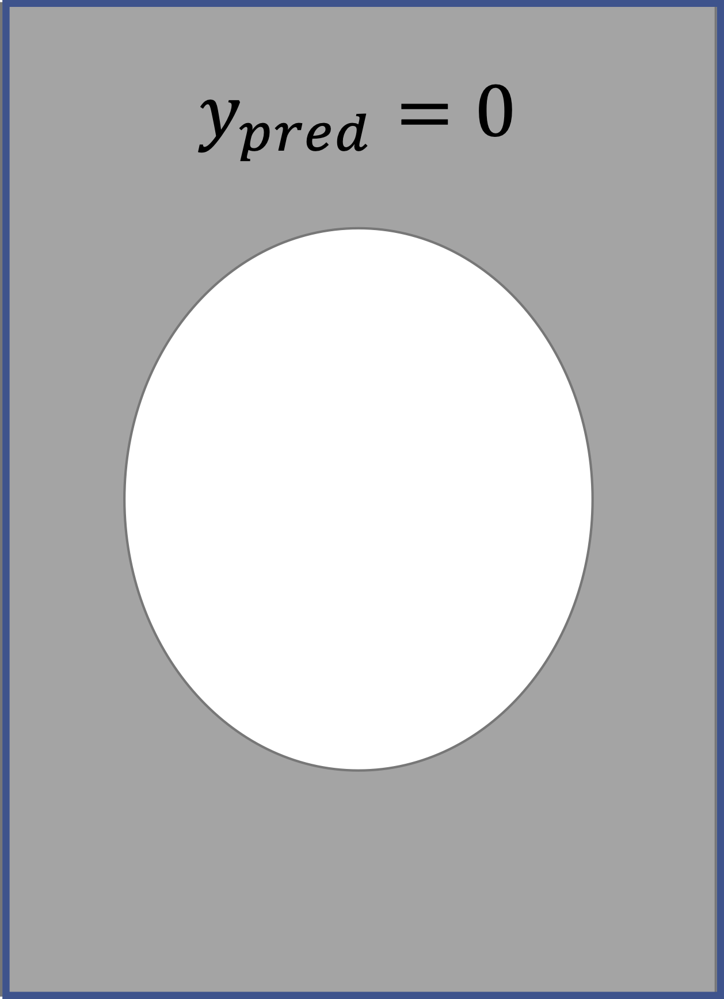
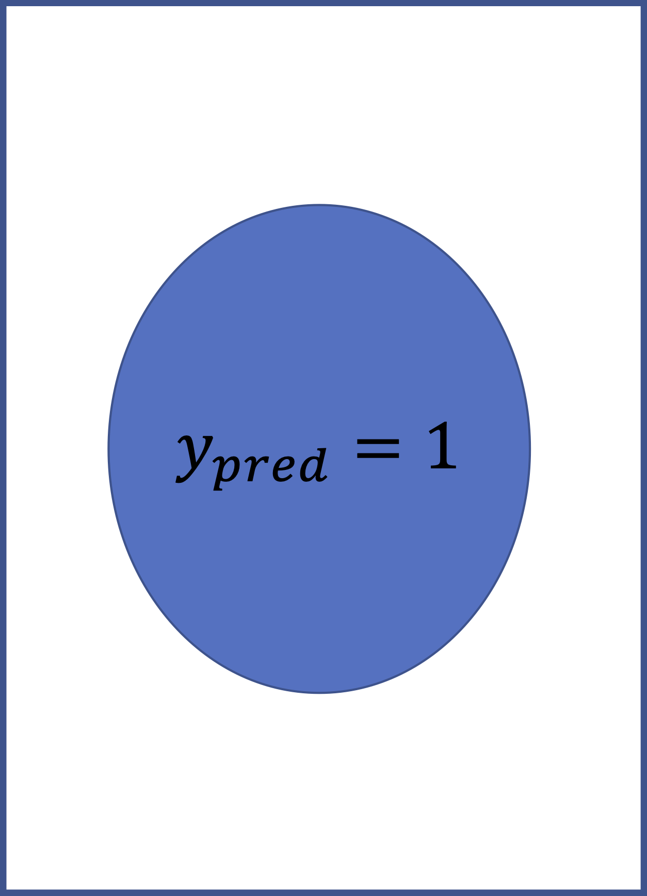
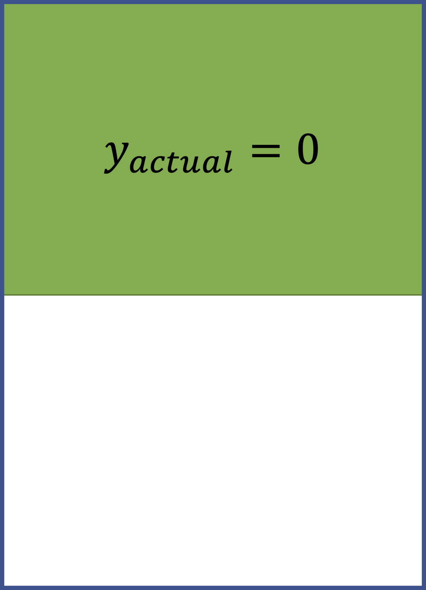
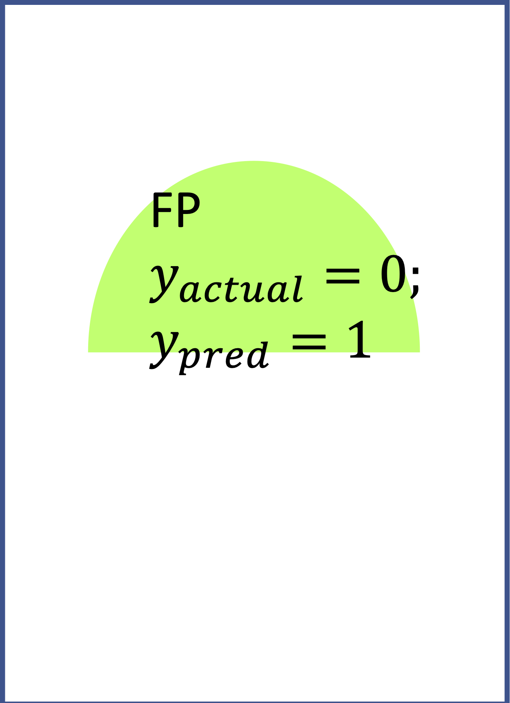
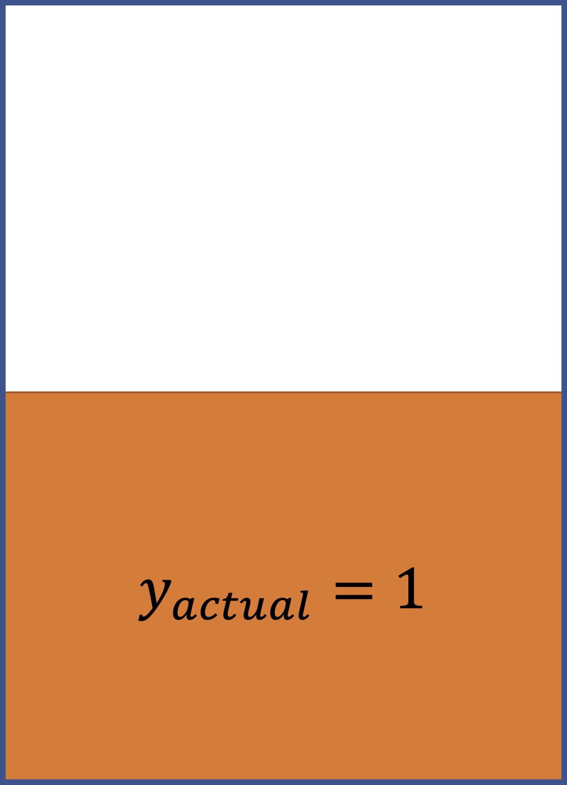
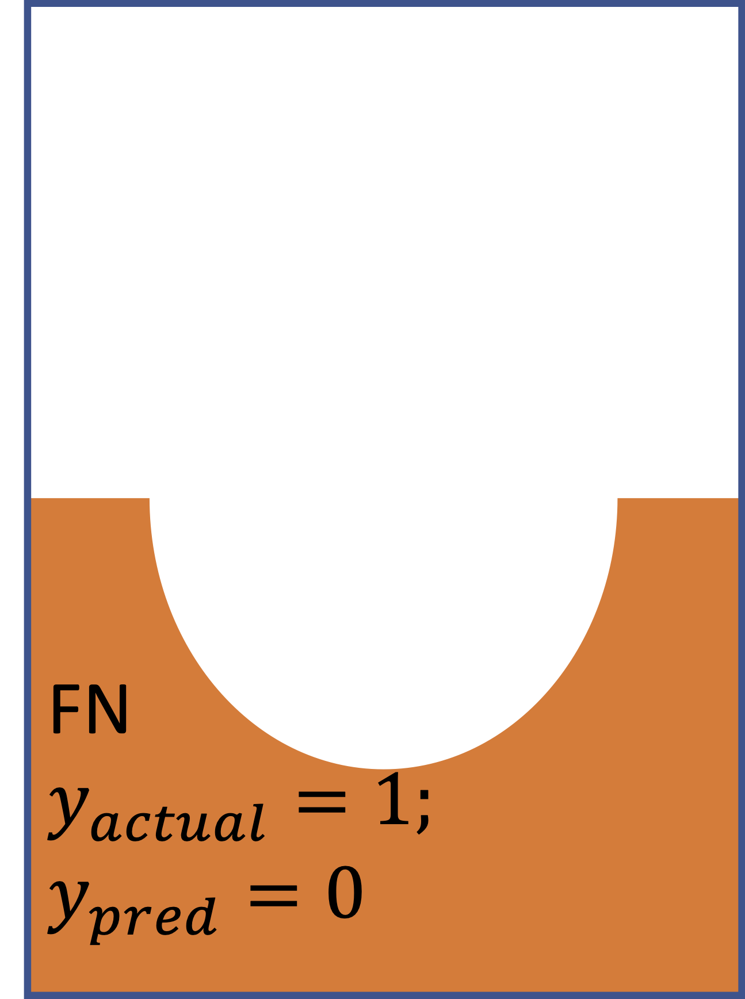
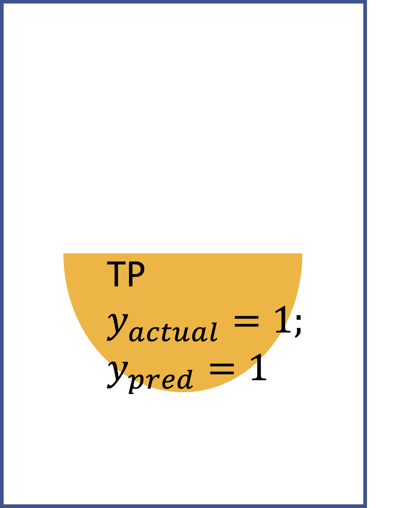

<table>
  <tr>
    <td>
\ Predict
Actual</td>
    <td></td>
    <td></td>
    <td>Sum</td>
  </tr>
  <tr>
    <td>
      
    </td>
    <td>
      
    </td>
    <td>
      
    </td>
  </tr>
  <tr>
    <td>
      
    </td>
    <td>
      
    </td>
    <td>
      
    </td>
  </tr>
  <tr>
    <td>Sum</td>
  </tr>
  </table>
