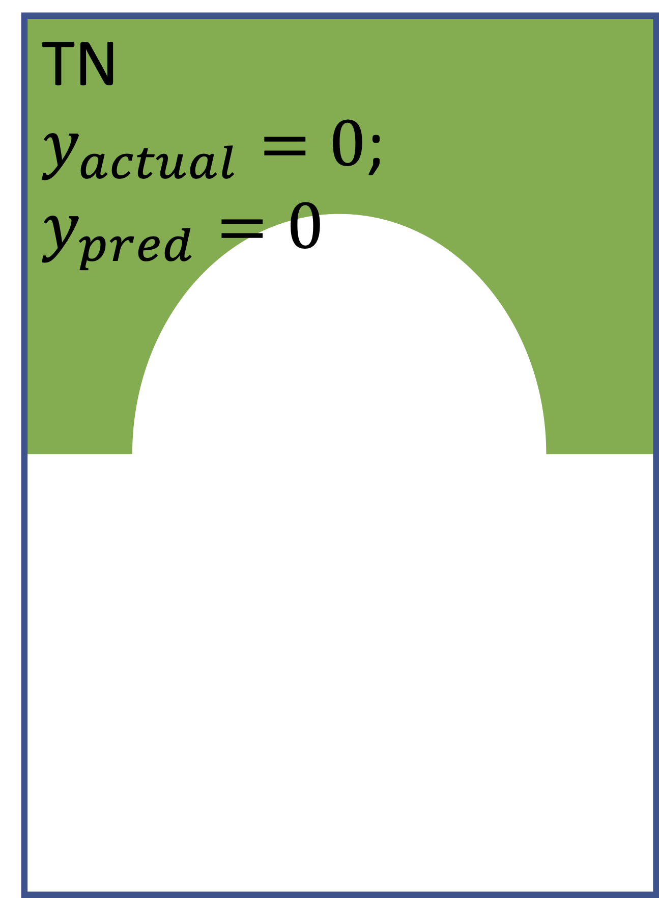

<table>
  <tr>
    <td>
\ Predict
Actual</td>
    <td></td>
    <td></td>
    <td>Sum</td>
  </tr>
  <tr>
    <td>
      
    </td>
    <td>
      
    </td>
    <td>
      
    </td>
    <td>
      N = TN + FP
    </td>
  </tr>
  <tr>
    <td>
      
    </td>
    <td>
      
    </td>
    <td>
      
    </td>
    <td>
      P = FN + TP
    </td>
  </tr>
  <tr>
    <td>Sum</td>
    <td>TN + FN</td>
    <td>TP + FP</td>
    <td>All samples</td>
  </tr>
  </table>

Derived Index | Definition | Visualization 1 | Visualization 2
--- | --- | --- | ---
Recall, True Positive Rate, y-axis of the ROC curve | prob(ypred=1 \| yactual=1) |  | 
False Positive Rate, x-axis of the ROC curve | prob(ypred=1 \| yactual=0) |  | 

Note. Raising classification threshold does not decrease recall in Visualization 1, but does not impact recall n Visualization 2.
This illustrates why recall will **always decrease or stay the same** when raising classification threshold.

Classification models with varying predictive power: 

 (<a href="http://gim.unmc.edu/dxtests/roc3.htm">image source</a>)  

Raising classification decision threshold: 

 (modified from <a href="https://towardsdatascience.com/fine-tuning-a-classifier-in-scikit-learn-66e048c21e65">image source</a>)    

Derived Index | Definition | Visualization 1 | Visualization 2
--- | --- | --- | ---
Precision | prob(yactual=1 \| ypred=1) |  | 

Note. Raising classification threshold does not impact precision in Visualization 1, but increases precision in Visualization 2.
This illustrates why raising classification threshold will usually (**but not always**) increase precision.

For other illustrations, please see the <a href="./images/visualization_of_confusion_matrix.pptx">PowerPoint deck</a> I made.
