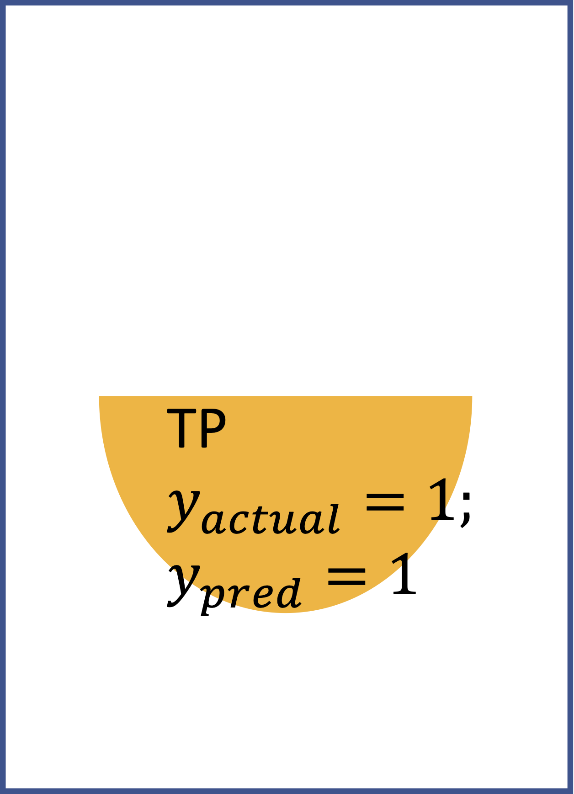

<table>
  <tr>
    <td>
\ Predict
Actual</td>
    <td></td>
    <td></td>
    <td>Sum</td>
  </tr>
  <tr>
    <td>
      
    </td>
    <td>
      
    </td>
    <td>
      
    </td>
    <td>
      N = TN + FP
    </td>
  </tr>
  <tr>
    <td>
      
    </td>
    <td>
      
    </td>
    <td>
      
    </td>
    <td>
      P = FN + TP
    </td>
  </tr>
  <tr>
    <td>Sum</td>
    <td>TN + FN</td>
    <td>TP + FP</td>
    <td>All samples</td>
  </tr>
  </table>
