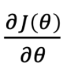
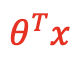
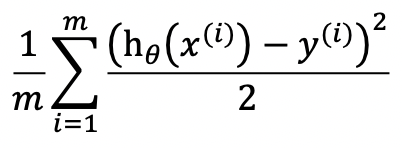
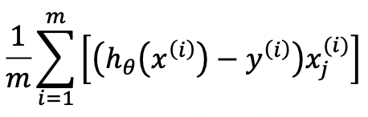
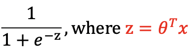
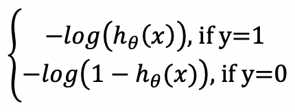
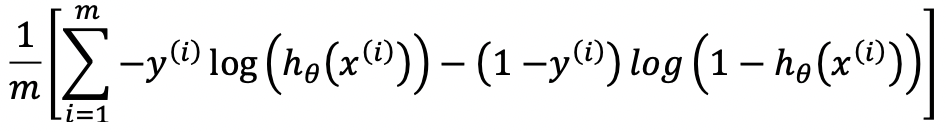
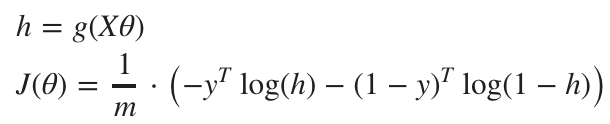
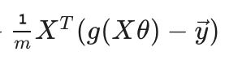

Importantly, a cost function **connects the algorithm's θ with its prediction loss (error)**, just like how a person (the optimization method) trying to walk down to the bottom in an error mountain/surface* (the higher the altitude the greater the error) could translate the current thinking (θ) in a thought path (θ's) to the corresponding altitude (the loss/error).

\*The error mountain/surface describes the difference between the ground truth (y) and an algorithm (hθ(x)).

In other words, a cost function connects the algorithm's θ with the difference between y and hθ(x) (= y_hat = y_pred).

Algorithm | y_pred | Implementation of the cost function, J(θ) = loss Generally, the idea is (hθ(x) - y)2 | Implementation of the gradient 
--- | --- | --- | ---
Linear Regression |  |  | 
Ridge Regression; Regularized Linear Regression | --- | --- | ---
Logistic Regression |  | Avoid using (hθ(x) - y)2directly because it tends to be wavy and non-convex.  Instead, we use cross-entropy, or log loss:   or,   or,  |  or,  , where g(z) is the sigmoid function
Neural Networks | --- | --- | ---

