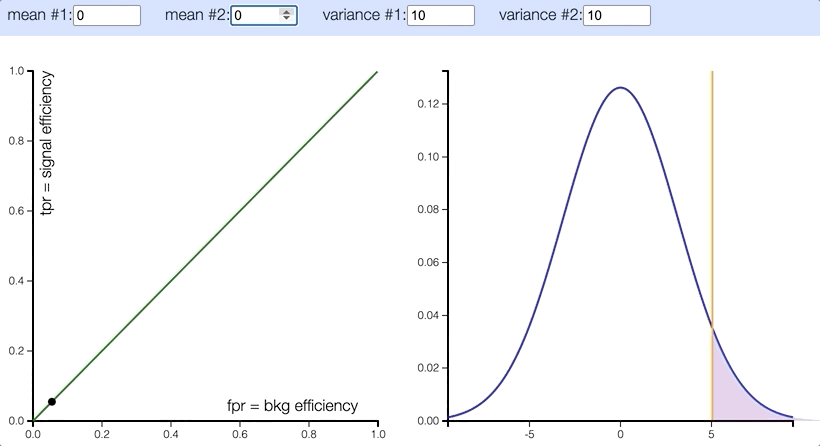

## ROC curve

 Ideally, a ML classification algorithm would improve over time via training, resulting in a cleaner separation of the y probability distributions of True Positive vs. True Negative, given X's (<a href="http://arogozhnikov.github.io/2015/10/05/roc-curve.html">website reference</a>)

## <a href="./gradient_descent">Gradient Descent</a>
