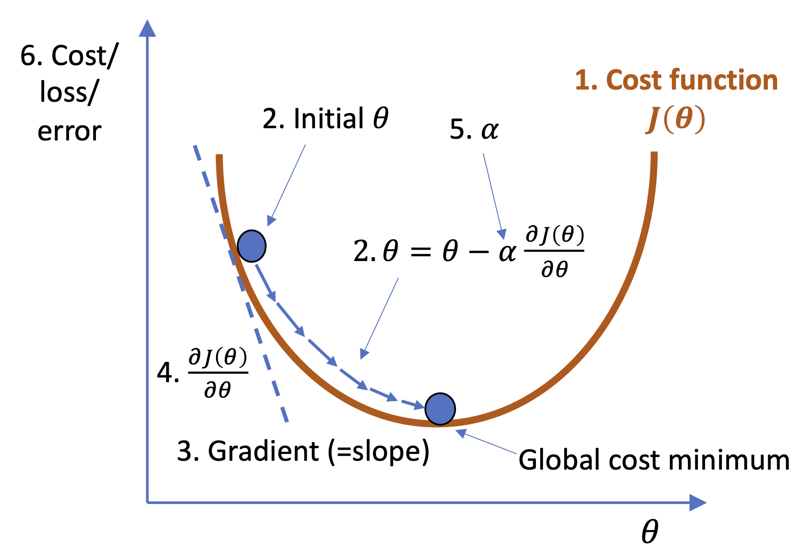

## 1. ROC curve

 Ideally, a ML classification algorithm would improve over time via training, resulting in greater predictive power, namely, a cleaner separation of the y probability distributions of True Positive vs. True Negative, given X's (<a href="http://arogozhnikov.github.io/2015/10/05/roc-curve.html">website reference</a>)

## 2. <a href="https://en.wikipedia.org/wiki/Gradient_descent">Gradient Descent</a>

A **first-order** (namely, an algorithm that requires at least one first-derivative/gradient) iterative optimization algorithm that finds the weights or coefficients that reach a local minimum of a differentiable function.

#### Step#1: The model makes predictions on training data.
#### Step#2: Using the error on the predictions to update the model in such a way as to minimize the error.
#### Step#3: The update to model is to move it along a gradient (slope) of errors down toward a minimum error value.

Analogy | Gradient Descent
--- | ---
1.&nbsp;A person, who is stuck in the mountain and trying to get down | the algorithm, which is somewhere in the error surface and trying to find the global minimum
2.&nbsp;Path taken down the mountain | the sequence of parameter settings (coefficients or weights) that the algorithm will explore
3.&nbsp;The steepness of the hill (the direction to travel is the steepest descent) | the slope/gradient of the errors surface at that point
4.&nbsp;The instrument used to measure steepness | differentiation (derivative) of the cost function
5.&nbsp;The amount of time they travel before taking another measurement | the learning rate of the algorithm
6.&nbsp;The altitude of the person's location | the error the model makes when predicting on training data

Optimization Approach | ---
--- | ---
<a href="./batch_gradient_descent">Batch Gradient Descent</a> | - Calculates the error for each sample in the training dataset, but only updates the model after all training samples have been evaluated. - If there are 3 millions samples, we need to sum the errors of 3 million times. - One cycle through the entire training set is called a training epoch.
<a href="./stochastic_gradient_descent">Stochastic Gradient Descent</a> (SGD) | - Instead of using the entire training set every time, use only 1 sample - Before for-looping, randomly shuffle the training samples.
<a href="./mini_batch_gradient_descent">Mini-Batch Gradient Descent</a> | - The common ground between batch and SGD. - Use n data points (instead of 1 sample in SGD) at each iteration. - It is the most common implementation of gradident descent in the field of deep learning.

### Visualization of Gradident Descent
