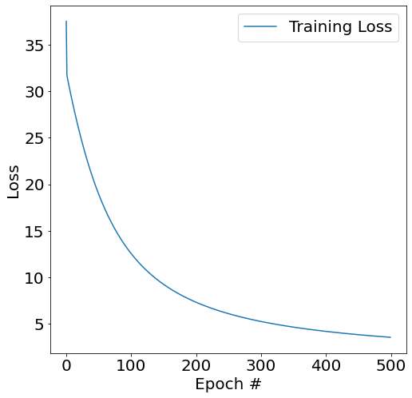

## 1. ROC curve

<p align="center"><br/>Ideally, a ML classification algorithm would improve over time via training, resulting in greater predictive power, namely, a cleaner separation of the y probability distributions of True Positive vs. True Negative, given X's (<a href="http://arogozhnikov.github.io/2015/10/05/roc-curve.html">website reference</a>)</p>

<hr>

## 2. <a href="https://en.wikipedia.org/wiki/Gradient_descent">Gradient Descent</a>

A **first-order** (namely, a method that requires at least one first-derivative/gradient) iterative **optimization** method that finds the weights or coefficients that reach a local minimum of a differentiable function.

#### Step#1: The model makes predictions on training data.
#### Step#2: Using the error on the predictions to update the model in such a way as to minimize the error.
#### Step#3: The update to model is to move it along a gradient (slope) of errors down toward a minimum error value.

Analogy | Gradient Descent
--- | ---
1.&nbsp;A person, who is stuck in the mountain and trying to get down | the method, which is somewhere in the errors surface and trying to find θ that globally minimizes J(θ)
2.&nbsp;Path taken down the mountain | the sequence of θ parameters (coefficients or weights) that the algorithm will explore
3.&nbsp;The steepness of the hill (the direction to travel is the steepest descent) | the slope/gradient of J(θ) with respect to θ
4.&nbsp;The instrument used to measure steepness | differentiation of the cost function, the **partial derivative of J(θ) with respect to θ**
5.&nbsp;The amount of time they travel before taking another measurement | the learning rate of the algorithm, α
6.&nbsp;The altitude of the person's location | the error the model makes when predicting on training data, J(θ)

<p align="center"></p>

<hr>

#### Descriptions:

Approach | Details
--- | ---
Batch | - Calculates the error for each example in the training dataset, but only updates the model after **the entire training set** has been evaluated.<br/>- If there are 3 millions examples, we need to sum the errors of 3 million times.<br/>- One cycle through the entire training set is called a training epoch.<br/>- When we refer to gradient descent, we typically mean the batch gradient descent.
<a href="https://www.geeksforgeeks.org/ml-stochastic-gradient-descent-sgd/?ref=lbp">Stochastic</a> (SGD) | - Instead of using the entire training set every time, use **just 1 example**<br/>- Before for-looping, randomly shuffle the training examples.
<a href="https://www.geeksforgeeks.org/ml-mini-batch-gradient-descent-with-python/">Mini-Batch</a> | - The common ground between batch and SGD.<br/>- Use **n data points** (instead of just 1 example in SGD) at each iteration.<br/>- It is the most common implementation of gradident descent in the field of deep learning.

<hr>

#### Comparisons:

Approach | Pros | Cons | Implementation
--- | --- | --- | ---
Batch | - More stable convergence | - May have local minimum<br/>- Very slow for large data sets<br/>- Take a lot of memory | ---
Stochastic (SGD) | - Faster learning for large data sets<br/>- May avoid local minimum due to the noise | - Harder to converge<br/>- Higher variance | <a href="https://scikit-learn.org/stable/modules/generated/sklearn.linear_model.SGDClassifier.html#sklearn.linear_model.SGDClassifier">sklearn.linear_model.SGDClassifier</a>
Mini-Batch | - More robust convergence than batch by avoiding local minimum<br/>- Take less memory than batch<br/> | - Need to specify n (mini-batch size, usually 32) | <a href="https://scikit-learn.org/stable/modules/generated/sklearn.linear_model.SGDClassifier.html#sklearn.linear_model.SGDClassifier">sklearn.linear_model.SGDClassifier</a>.partial_fit()

<hr>

## 3. Example of batch gradient descent -- logistic regression with two features

Learning rate α | Number of iterations (epochs) | Decision Boundary | Training Loss
--- | --- | --- | ---
0.1 | 500 |  | 
0.05 | 1000 |  | 

References:
- My own <a href="./batch_gradient_descent/logistic_regression_two_features.py">Python code</a> that produced the results
- For producing animations, <a href="./batch_gradient_descent/animation.py">python</a> and <a href="./batch_gradient_descent/animation.ipynb">ipynb</a>

<hr>

## 4. Other Python code examples

```python3
def Batch_Gradient_Descent(X, y, theta0, alpha, num_iters): # for linear regression
    """
       Performs gradient descent to learn theta
    """
    m = y.size  # number of training examples
    theta = theta0
    for i in range(num_iters):
        y_hat = np.dot(X, theta)
        gradient = (1.0/m) * np.dot(X.T, y_hat-y)
        theta = theta - (alpha * gradient)
    return theta
    
def Stochastic_Gradient_Descent(f_derivative, theta0, alpha, num_iters): # A general case
    """ 
       Arguments:
       f_derivate -- the function to optimize, it takes a single argument
                     and yield two outputs, a cost and the gradient
                     with respect to the arguments
       theta0 -- the initial point to start SGD from
       num_iters -- total iterations to run SGD for
       Return:
       theta -- the parameter value after SGD finishes
    """
    start_iter = 0
    theta = theta0
    for iter in xrange(start_iter + 1, num_iters + 1):
        _, gradient = f_derivate(theta)
        theta = theta - (alpha * gradient)
    return theta
    
# reference: https://towardsdatascience.com/difference-between-batch-gradient-descent-and-stochastic-gradient-descent-1187f1291aa1
```

<hr>

## 5. Mini-Batch Gradient Descent in Python

Python <a href="./mini_batch_GD_logistic_regression.py">code</a>


<hr>

## 6. Visualization of Different Optimizers

<p align="center"><br/>(<a href="https://towardsdatascience.com/why-visualize-gradient-descent-optimization-algorithms-a393806eee2">image source</a>; see also <a href="https://github.com/ilguyi/optimizers.numpy">here</a>)</p>

References:
- <a href="https://www.geeksforgeeks.org/ml-momentum-based-gradient-optimizer-introduction/?ref=lbp">Momentum-based</a> gradient optimizer
- <a href="https://www.geeksforgeeks.org/ml-xgboost-extreme-gradient-boosting/?ref=lbp">eXtreme Gradient Boosting</a>
- <a href="http://www.oranlooney.com/post/ml-from-scratch-part-2-logistic-regression/">Nesterov Accelerated Gradient</a> (NAG)
- <a href="https://machinelearningmastery.com/adam-optimization-algorithm-for-deep-learning/">Adam</a> Optimizer (also introduction of AdaGrad and RMSProp)
