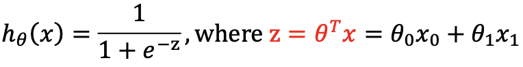

Cost function measures the difference between y and y_pred (= y_hat = hθ(x))

Algorithm | y_pred | General idea of the cost function | Implementation of J(θ)
--- | --- | --- | ---
Linear Regression | --- | (y_pred - y)2 | 
Logistic Regression |  | Cross-entropy, or log loss  | 
Neural Networks | --- | --- | ---

