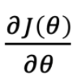
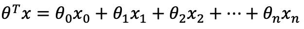
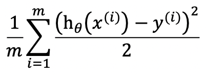
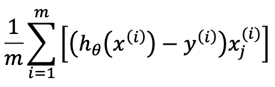
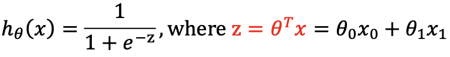
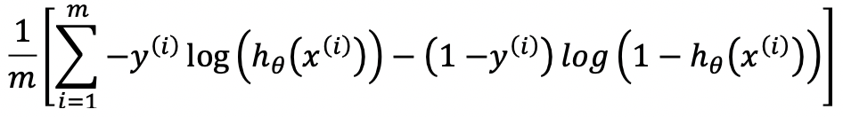

Cost function measures the difference between y and y_pred (= y_hat = hθ(x))

Algorithm | y_pred | Implementation of the cost function, J(θ) = loss Generally, the idea is (y_pred - y)2 | Implementation of the gradient 
--- | --- | --- | ---
Linear Regression |  |  | 
Logistic Regression |  | Avoid using (y_pred - y)2directly because it tends to be wavy and non-convex.  Instead, we use cross-entropy, or log loss:  or,  | ---
Neural Networks | --- | --- | ---

