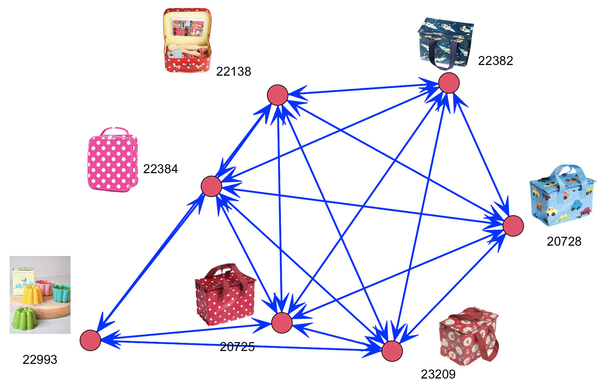

# Network Analysis (General)

To see the relationship among entities

## Package:

<a href='https://networkx.org/'>NetworkX</a>

# Network Analysis (Retail)

To see the dyanmics of how item purchases affect one another

## Concepts:

A customer purchased item A at Time 1, and then purchased items B, C at Time 2. This can translate to a dynamic link: A => B, A => C, reflecting how antecedent item purchase(s) affect subsequent item purchase(s).

## Example of transactions data:

The following network graph was generated using the <a href="https://archive.ics.uci.edu/ml/datasets/online+retail">UCI online retail dataset</a> and my <a href="./network_analysis.R">variation</a> of a <a href="https://rpubs.com/tahamokfi/Part2_AnalyzeTransactionData">network analysis code</a> in R.

 
Note 1. The number is the item's StockCode, and the graph reflects the top 10 <b><a href="https://igraph.org/r/doc/betweenness.html">betweenness</a></b>, which is the number of shortest paths going through a node or path. A product with higher betweenness centrality, <b>a hub node</b>, has more influence over the network of products. Note 2. Arrows indicate that purchasing an <b><i>antecedent</i></b> item increases the likelihood of purchasing a <b><i>subsequent</i></b> item.

