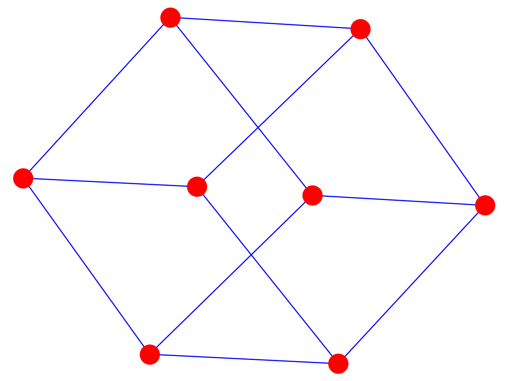

```python3
import networkx as nx
G = nx.Graph()
G.add_edge('y', 'x', function=math.cos)
G.nodes
G.edges
G['x']['y'] # returns the edge attribute dictionary.
import matplotlib.pyplot as plt
plt.subplot(121)
nx.draw(G)
plt.show()
G = nx.cubical_graph()
nx.draw(G, pos=nx.spring_layout(G), node_color='r', edge_color='b')
```

<br/>
