# Neural Networks
Using hidden layer(s) to simulate complicated functions

Note. When the number of hidden layers ≥ 2, it is usually called <a href="https://en.wikipedia.org/wiki/Deep_learning">deep neural networks</a>.

## Example code and output
* Code: <a href="./neuralnet_example.R">R code example using the neuralnet package</a>
* Description: Using "<b>TKS</b>" (Technical Knowledge Score)" and "<b>CSS</b>" (Communication Skills Score) to predict student <b>Placed</b> or not (1/0), using 3 nodes in the hidden layer and "logistic" activation function
* Key concept: Activation function determines whether the neuron should be activated and normalizes the output to be between [0, 1] or [-1, 1]
* Output 1: The training set

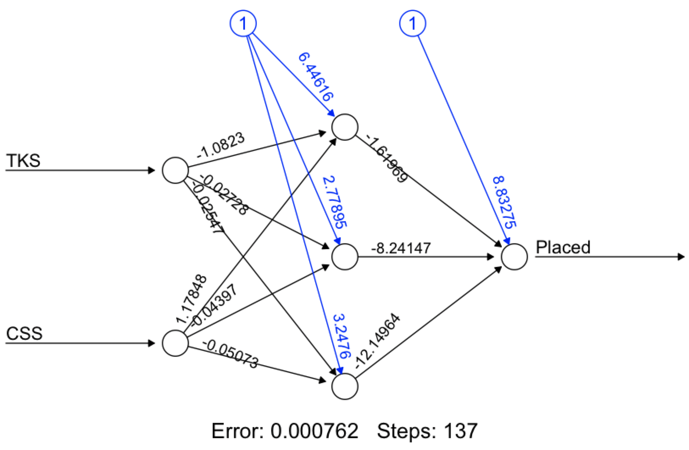

* Output 2: The testing set:
<table align="center">
<tr><th>Technical Knowledge Score</th><th>Communication Skills Score</th><th>predicted Placed or not</th></tr>
<tr><td>30</td><td>85</td><td>1 (Y)</td></tr>
<tr><td>40</td><td>50</td><td>0 (N)</td></tr>
<tr><td>85</td><td>40</td><td>1 (Y)</td></tr>
</table>

## Neural network models

Model | Description | Use
--- | --- | ---
Standard NN | 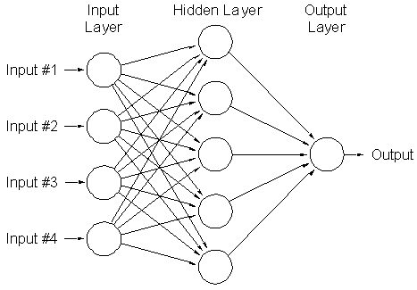 (<a href="https://www.quora.com/What-are-the-necessary-parameters-to-use-an-artificial-neural-network-aka-ANN-package-in-R">image source</a>) | Online advertising, clicking classification
Convolutional NN (deep learning) |  (<a href="https://www.mathworks.com/discovery/convolutional-neural-network.html">image source</a>)| Image and photo tagging
Recurrent NN | 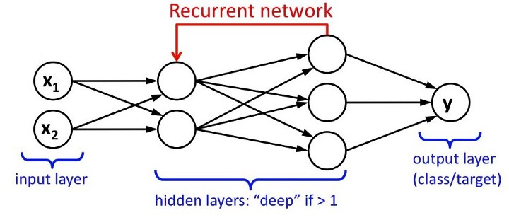 (<a href="https://medium.com/@curiousily/making-a-predictive-keyboard-using-recurrent-neural-networks-tensorflow-for-hackers-part-v-3f238d824218">image source</a>) | Speech recognition

## <a href="https://en.wikipedia.org/wiki/Activation_function">Activation function</a>
Activation function defines the output of a neuron in terms of its local input field.

Name | Equation | Graph | Derivative | Use
--- | --- | --- | --- | ---
<a href="https://en.wikipedia.org/wiki/Logistic_function">Logistic/sigmoid</a> | 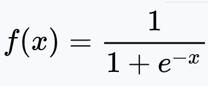 | 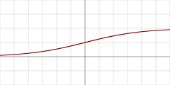 | 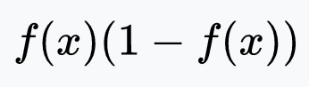 | Classification
<a href="https://en.wikipedia.org/wiki/Hyperbolic_function#Hyperbolic_tangent">Hyperbolic tangent</a> | 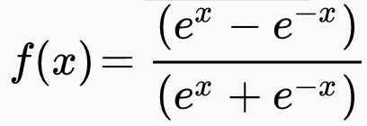 | 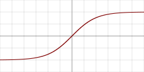 | 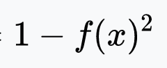 | Classification between two classes
<a href="https://en.wikipedia.org/wiki/Rectifier_(neural_networks)">ReLU (Rectified linear unit)</a> | 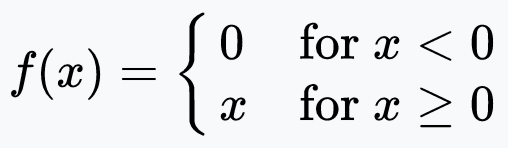 | 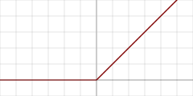 | 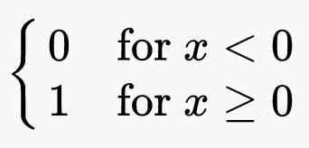 | The hidden layers
<a href="https://en.wikipedia.org/wiki/Rectifier_(neural_networks)#Leaky_ReLUs">Leaky ReLU | 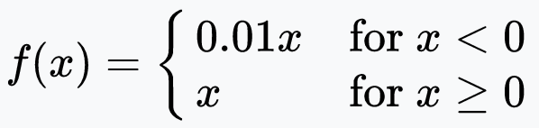 | 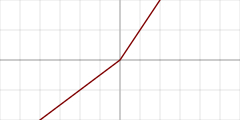 | 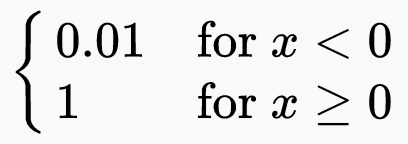 | prevent dying ReLU problem
<a href="https://arxiv.org/abs/1710.05941">Swish</a> | Y = X * sigmoid(X) | 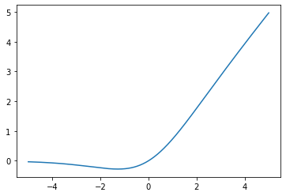 | Y + sigmoid(X) * (1-Y) | With no bounds, it avoids problems when gradients are nearly zero and was shown to outperform the ReLU function in classification.
<a href="https://en.wikipedia.org/wiki/Softmax_function">Softmax</a> | 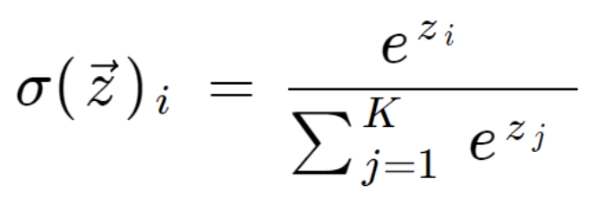 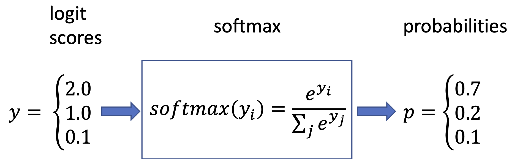 | 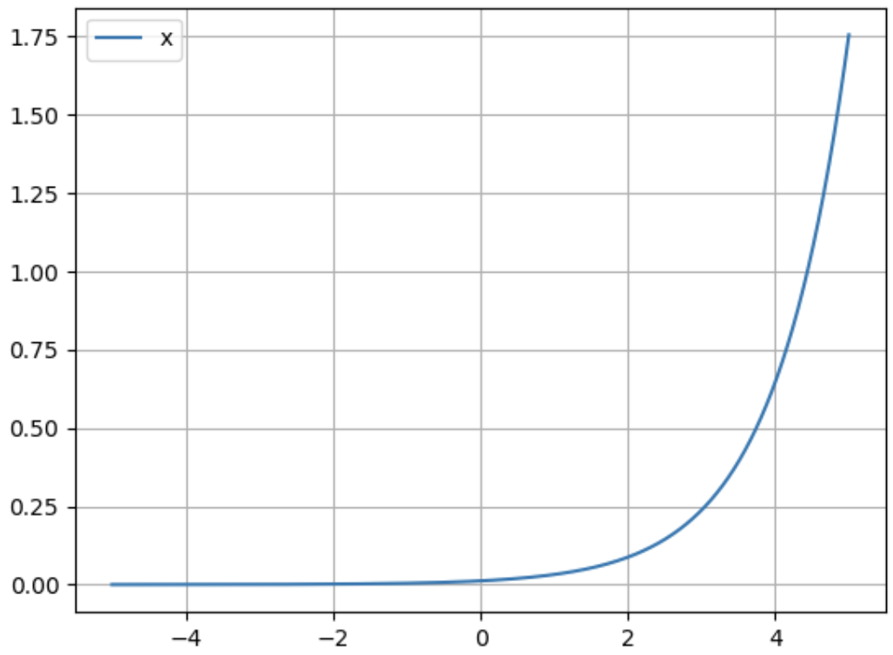 | softmax(xi)(1-softmax(xi)) | A generalized form of the sigmoid function, it can be used for multiclass classification.  With two classes, it becomes the sigmoid function.

Here is a comprehensive table of activation functions (<a href="https://medium.com/@himanshuxd/activation-functions-sigmoid-relu-leaky-relu-and-softmax-basics-for-neural-networks-and-deep-8d9c70eed91e">source</a>):

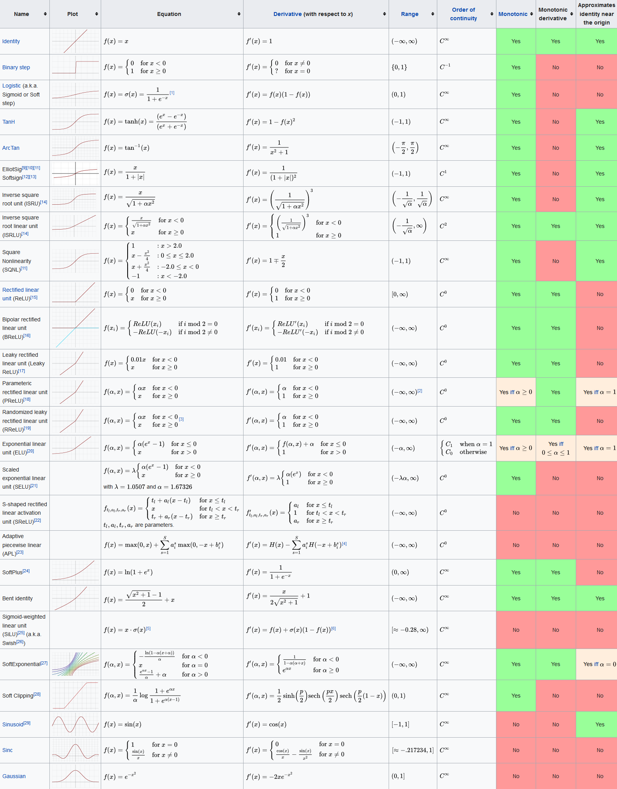

## Key question 1: how to choose a suitable activation function?

The brief answer is that it depends on the desired qualify for the activation function. For example:
* tanh has a steeper derivative than sigmoid, to allow learning for very high or very low values of X
* tanh has [-1, 1] output, whereas sigmoid has [0, 1]
* ReLU allows the network to converge quickly
* Leaky ReLU prevents dying ReLU problems
* Softmax can handle multi-class and can be used in the output layer

## Key question 2: can one combine different activation functions in a neural network?

The brief answer is yes. Some examples are as follows:
* To perform multi-class classification, one can build a MultiLayer Perceptron with any activation and a softmax readout layer.
* A recurrent neural network (RNN) with Long short-term memory (LSTM) unit has at least two activation functions (logistic, tanh, and any other activations).
* To perform a regression task, one can use ReLU (Rectified linear unit) activations in the hidden layers and a linear function in the readout layer.
* It will also be possible to automatically learn and find out the optimal activation function for a certain neural network and to even automatically combine activation functions to achieve the highest accuracy.

## References:
* <a href="https://missinglink.ai/guides/neural-network-concepts/7-types-neural-network-activation-functions-right/">How to choose activation functions?</a>
* <a href="https://playground.tensorflow.org/#activation=tanh&batchSize=10&dataset=circle&regDataset=reg-plane&learningRate=0.03&regularizationRate=0&noise=0&networkShape=4,2&seed=0.58627&showTestData=false&discretize=false&percTrainData=50&x=true&y=true&xTimesY=false&xSquared=false&ySquared=false&cosX=false&sinX=false&cosY=false&sinY=false&collectStats=false&problem=classification&initZero=false&hideText=false">A tensorflow playground</a>
