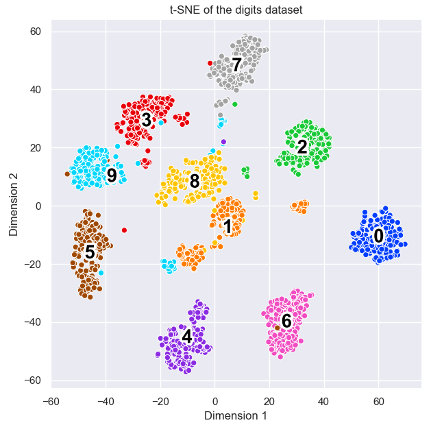

# <a href="https://lvdmaaten.github.io/tsne/">t-SNE</a> (t-distributed Stochastic Neighbor Embedding)
To map/reduce high-dimensional data to a lower-dimensional (2D or 3D) space for visualization, while preserving and embedding significant structure in the original data.

## Key Concepts

Term | Definition
--- | ---
Similarity | * The similarity of datapoint (x_J) to (x_I) is the conditional probability, p(J \| I); * That is, (x_I) would pick (x_J) as its neighbor if neighbors were picked in proportion to their probability density under a Gaussian or Student's t-distribution centered at (x_I).
Perplexity | * A user-specified number of neighbors (a hyperparameter); * Usually ranging between (5, 50); * A balance between local and global aspects of the data

## Implmentation

Steps | Description
--- | ---
#1 | In the high-dimensional space, convert high-dimensional Euclidean distances to <b>similarity</b> under a Gaussian distribution, while constrained by the <b>perplexity</b> parameter
#2 | In the low-dimensional space, compute the <b>similarity</b> between two points under a Student's <b>t-distribution</b> (df=1) rather than a Gaussian, to avoid the "crowding problem"
#3 | * To reduce the mismatch between the corresponding high and low dimension conditional probabilities, minimize the sum of Kullback-Leibler (KL) divergences over all datapoints using a gradient descent method;  * The cost function favors retaining nearby map points, preserving local structure in the data.

## Example 1: Credit Card Transactions

Using a <a href="https://www.kaggle.com/mlg-ulb/creditcardfraud">dataset</a> of credit card transactions, I performed my own <a href="./credit_card_fraud_t-SNE.R">variation</a> of a <a href="https://github.com/ihh300/Fraud_Detection/blob/master/cc_tsne.R">R code</a>.

The dataset has 284,807 transactions (492 fraud transactions and 284,315 legitimate transactions) and 29 feature variables. Using perplexity = 29, 1,000 iterations, and a balanced dataset (492 fraud transactions and 492 legitimate transactions), the t-SNE algorithm reduces the complicated higher-dimensional relationships between the 29 feature variables to a 2D space:

 Note. t-SNE preserves much of the distinction between the two classes using the 29 feature variables without knowing the Class variable.

## Example 2: The Digits Dataset</a>

Using the <a href="https://scikit-learn.org/stable/modules/generated/sklearn.datasets.load_digits.html">digits</a> dataset, I ran my modified version of <a href="./digits_t-SNE.py">t-SNE Python code</a>. The results are as following:

## Comparison

Algorithm | Implementation for visualization | Preserving structure in the original data
--- | --- | ---
<a href="https://en.wikipedia.org/wiki/Principal_component_analysis">PCA (Principal component analysis)</a> | 1. Identifying a directional axis that results in the highest variance of the high-dimensional data (<a href="https://medium.com/@TheDataGyan/dimensionality-reduction-with-pca-and-t-sne-in-r-2715683819">1st PC</a>); 2. Linearly projecting the high dimensional dataset into a lower dimensional space as described by the 1st PC and its orthagonal direction; 3. Visualizing the transformed data in 2D. | As a linear dimension reduction technique, PCA is <i><b>unable</b></i> to preserve complex relationships between features in the original data.
<a href="https://en.wikipedia.org/wiki/T-distributed_stochastic_neighbor_embedding">t-SNE</a> | 1. Creating a 2D embedding of the high-dimensional data; 2. Selecting the points' locations in the 2D space by using a probability distribution proportional to a similarity measure of two data points in the original data; 3. Minimizing the KL divergence between the probability distribution of the 2D embedding and the original data. | * Able to well capture much of the local structure of the high-dimensional data; * Able to reveal global structure such as the presence of clusters at several scales.

## References
- <a href="https://arxiv.org/pdf/1707.04639.pdf">Visualizing employees' attributes in the retail industry</a> 
- <a href="https://towardsdatascience.com/an-introduction-to-t-sne-with-python-example-5a3a293108d1">Python example</a>
- <a href="../UMAP">UMAP</a>, a technique arguably better than t-SNE
